| Order | Book                               | When to read             | Why                                            |
| ----- | ---------------------------------- | ------------------------ | ---------------------------------------------- |
| 1️⃣   | **Brain Rules for Baby**           | pregnancy                | Covers pregnancy through age 5, very practical |
| 2️⃣   | **How Toddlers Thrive**            | After baby arrives       | Specific to ages 1-4                           |
| 3️⃣   | **Einstein Never Used Flashcards** | When planning activities | Validates play-based approach                  |
# Brain Rules for Baby

## 引言：育儿的终极目标是孩子大脑发育

这本书用脑科学回答父母最关心的6个问题：如何让孩子聪明、快乐、有道德、睡得好、婚姻不崩、孕期怎么做。作者用严格的实验证据戳破无数育儿神话，告诉你真正的“种子”（基因）和“土壤”（环境）是什么。

你能获得：科学拆解哈佛录取关键、IQ提升50%的实操方法、让孩子一生幸福的黄金技能、彻底解决睡眠大战的四步法、婚姻不因孩子崩盘的两个步骤。

## 核心内容：

### 1. 育儿的本质是大脑发育，父母的任务是为孩子提供最好的“土壤”
- 孩子50%天赋来自基因（种子），另50%完全取决于后天环境（土壤）
- 0-5岁是大脑爆炸式发育期（每秒产生8000个神经元），这五年决定孩子一生的智力、情绪、性格基础
- 高质量的早期干预能带来7-12倍的社会回报率（HighScope研究追踪40年证实）


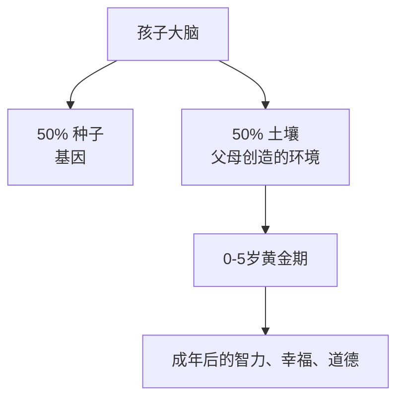

### 2. 科学才是靠谱的育儿指南，99%的育儿神话都是假的
- 孕期听莫扎特不会提高数学成绩，只会让孩子出生后认得出莫扎特
- 语言学习DVD不仅没用，反而会减少2岁前孩子的词汇量
- 不断说“你真聪明”会让孩子变笨，夸“努力”才真正提高成绩
- 昂贵的“益智玩具”不如一个纸箱+蜡笔


### 3. 每个孩子、每个父母都不一样，不存在“一招鲜”育儿法
- 所有大脑接线都不同，同一个方法对不同孩子效果天差地别
- 双亲家庭其实是两种教养风格的混合，必须100%合作
- 孩子还会受到同伴、学校、贫富差距的巨大影响
- 大多数研究只能说“相关”，不能说“必然导致”

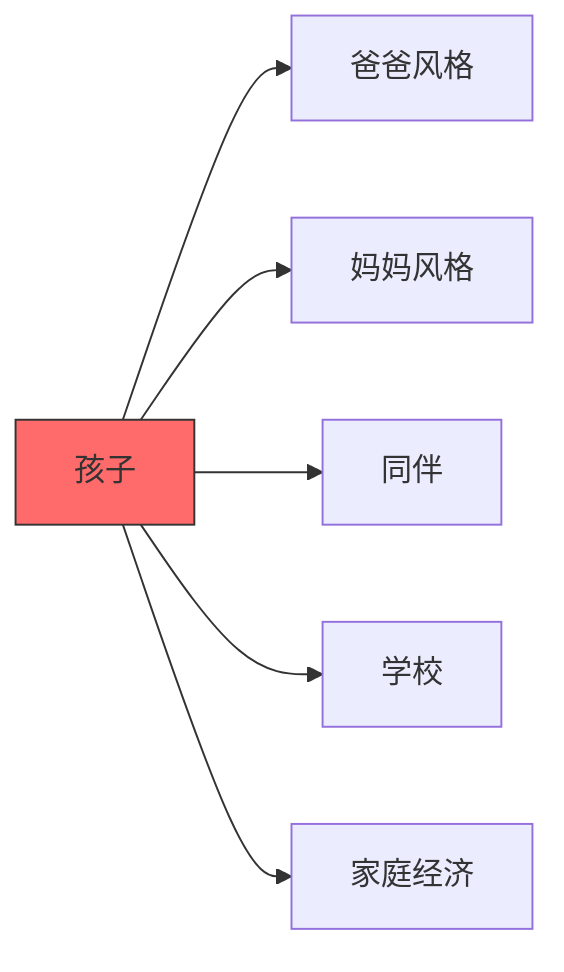

### 4. 人类为什么需要这么久的育儿期？因为我们的大脑太大了
- 直立行走让骨盆变窄，但大脑越来越大→生产时头太大母婴都危险
- 进化解决方案：提前把孩子生出来（大脑只发育了25%）
- 所以人类婴儿是“早产儿”，出生后需要父母多年“体外烘烤”


### 5. 父母真正能控制的，是给孩子“情感安全感”和“丰富刺激”
- 大脑只有在感到绝对安全时才能学习（这是所有学习的前提）
- 最好的益智工具：父母的脸、声音、情绪回应
- 最差的“玩具”：电视和屏幕


## 问答

### Q：这本书到底能教我把孩子送进哈佛吗？
A：能，但不是靠早教班。哈佛最看重的是“自我控制力”（比IQ重要2倍），这项能力在4岁前通过日常情绪训练就能建立。

### Q：看电视/早教机真的完全没用吗？
A：2岁前看电视每小时词汇量减少约1000个词；面对面和父母说话每小时增加约1000个词，差距2000词。

### Q：基因决定50%，那我努力还有用吗？
A：非常有用！剩下50%几乎全在父母手里，而且基因只是“潜力上限”，环境决定能发挥到多少。研究显示优秀养育能让孩子发挥到基因潜力的90%以上。

### Q：书里最反直觉的结论是什么？
A：你越想把孩子培养成“天才”，越容易把他培养成焦虑、没毅力、不快乐的人。真正的高成就者，童年都充满了自由玩耍和情绪安全，而不是提前学习。


## 实用建议汇总：大脑规则养育宝宝的终极操作清单

- 《大脑规则养育宝宝》全书最实用的部分，作者把所有科学证据转化为爸妈能立刻上手做的具体行动，覆盖怀孕到幼儿期，帮助孩子大脑发育更聪明、情绪更稳定、婚姻更稳固、道德更健全。

- 你能获得：孩子智商更高、情绪更稳定、夫妻关系不崩盘、自己少抑郁、养出真正聪明又快乐的小孩。

## 核心内容：

### 1. 怀孕期：前半期啥也别折腾，后半期认真吃动减压
- 前20周大脑自动发育，最好建议就是“别瞎折腾”，安心吐+每天吃够叶酸就行。
- 每天多吃300卡路里，重点吃蔬果（还能让宝宝出生后爱吃蔬菜）。
- 每天30分钟有氧运动（散步最佳），既减压又保护宝宝神经元。
- 把压力降到最低：列出“让我抓狂的事”清单，逐个夺回控制感。

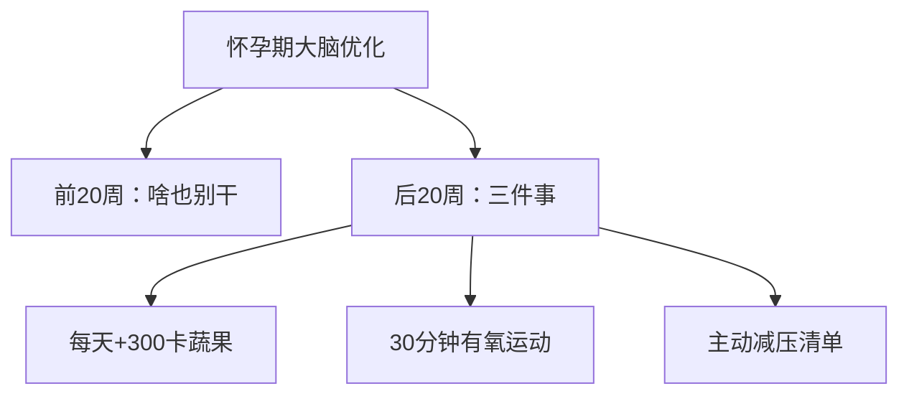

### 2. 夫妻关系：孩子出生前就把婚姻升级到“防崩盘模式”
- 每天早晚各check-in一次（电话/短信都行），维持连接。
- 提前安排好“计划性生活”，避免生娃后亲密度归零。
- 练“共情反射”：先描述情绪+猜原因，再解决问题。
- 家务立刻五五开（研究证明：家务平等=离婚率下降+性生活更多）。

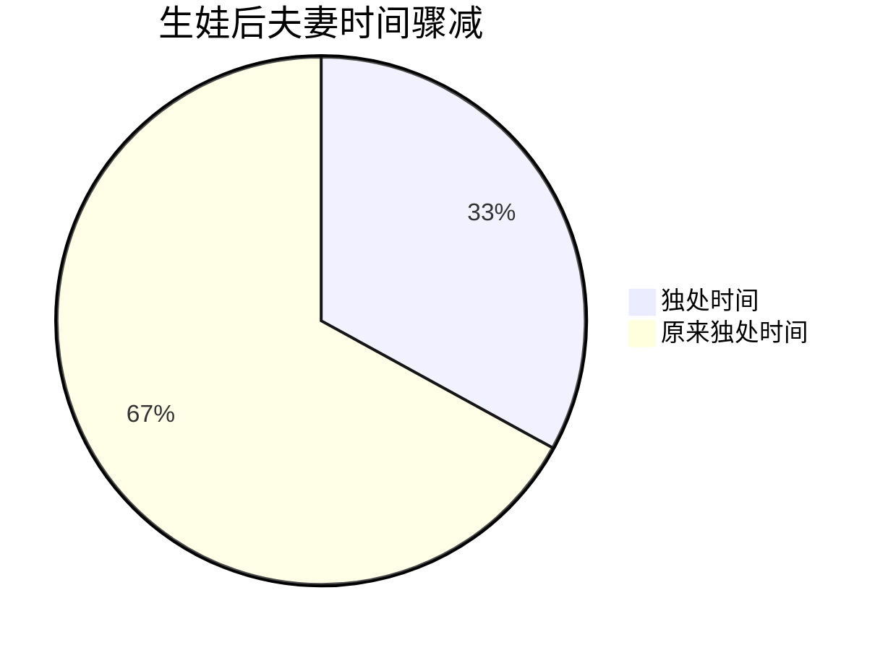

### 3. 重建“部落”：别指望两个人把孩子带好
- 提前组建可靠的社交支持网（亲子小组、朋友轮流做饭、教会等）。
- 最好在宝宝出生前就准备好50份冷冻餐，产后继续再做50份。

### 4. 让孩子更聪明：简单粗暴有效的方法
- 母乳喂养至少1年（益处巨大且证据确凿）。
- 每小时对宝宝说2100个字（用“父母语”高音调拉长元音）。
- 家里建“巧克力工厂”式游戏室：画画、乐器、积木、服装，孩子自由探索。
- 3岁后玩“相反日”游戏训练执行功能。
- 绝不“直升机式育儿”，给孩子开放式、无压力的探索空间。
- 表扬努力而非天赋：“哇你真努力！”而不是“你真聪明”。

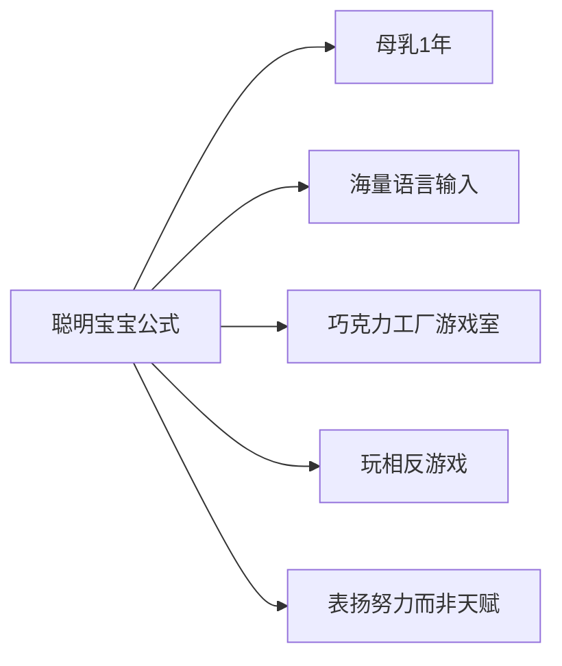

### 5. 让孩子更快乐：情绪智力比智商更重要
- 记录宝宝的“受够了”信号，学会及时撤退。
- 每天睡前全家大声读书（我们家坚持到孩子十几岁）。
- 随时练习共情：描述情绪+猜原因。
- 让孩子学10年乐器（对识别他人情绪能力提升巨大）。

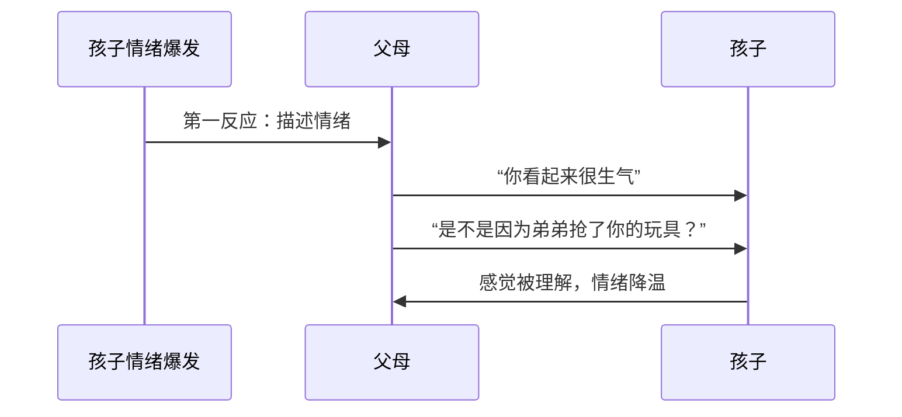

### 6. 让孩子有道德感：规则要CAP，惩罚要FIRST
- 规则必须：清晰（C）+温暖（A）+及时表扬（P）。
- 惩罚必须：坚定（F）+立即（I）+始终如一（R）+安全（S）+有耐心（T）。
- 永远解释规则背后的理由，帮助孩子内化道德而非害怕惩罚。

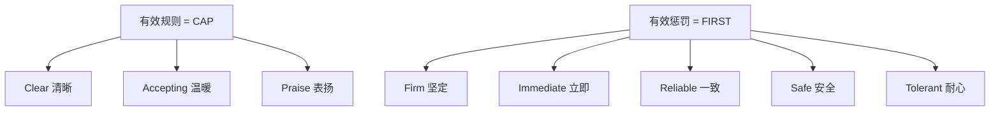

### 7. 其他狠招
- 提前找好心理医生（像儿科医生一样常备）。
- 屏幕时间用“读书换取制”：读1小时书=换一定时长的游戏时间。
- 偶尔录下自己带娃的视频，回看自己哪里做得好哪里可以改进。

## 问答

### Q：怀孕期间真的需要每天运动吗？
A：需要！每天30分钟有氧运动是目前最确定的减压方式，能降低皮质醇对宝宝大脑的伤害，同时降低产后抑郁风险。但一定要先问医生。

### Q：生完孩子夫妻生活真的会彻底消失吗？
A：平均会下降到原来的1/3。如果不提前做准备（计划性生活+每天连接），很多夫妻会因此出现严重危机。提前安排是唯一解药。

### Q：母乳真的对大脑发育那么重要吗？
A：是的，证据极其扎实。母乳喂养1年的孩子在认知、免疫、情绪调节等多项指标都显著优于非母乳喂养，差距能持续到青少年期。

### Q：怎么既让孩子会用电子产品又不沉迷？
A：我们家用“读书换屏幕时间”：读纸质书1小时=换30分钟游戏时间。孩子既养成了阅读习惯，又没被完全隔离在数字世界之外。

### Q：表扬孩子“聪明”和“努力”到底差在哪里？
A：表扬“你真聪明”会让孩子形成固定型思维，遇到困难就放弃；表扬“你真努力”培养成长型思维，孩子越挫越勇，长期智力表现更好。


## 《大脑规则养育宝宝》育儿秘诀

- 用一句话总结：育儿就是不断走进孩子的内心世界，用同理心读懂他的情绪，然后用温暖和规则陪伴他成长。你给孩子的，其实也在重塑你自己。

- 你能获得：更从容不焦虑的亲子关系、更聪明更快乐的孩子、以及一个更耐心、更会爱人的自己。

## 核心内容：

### 1. 育儿的核心只有两个字：同理心（Empathy）
- 真正厉害的父母不是教得最多，而是最懂得“暂时放下自己，跳进孩子的心理世界”。
- 同理心 = 心智理论（读懂对方在想什么）+ 善良（愿意用温柔回应）。
- 孩子越小，越需要大量面对面互动来练就“读脸”和“读心”技能，电视、手机、ipad都给不了。

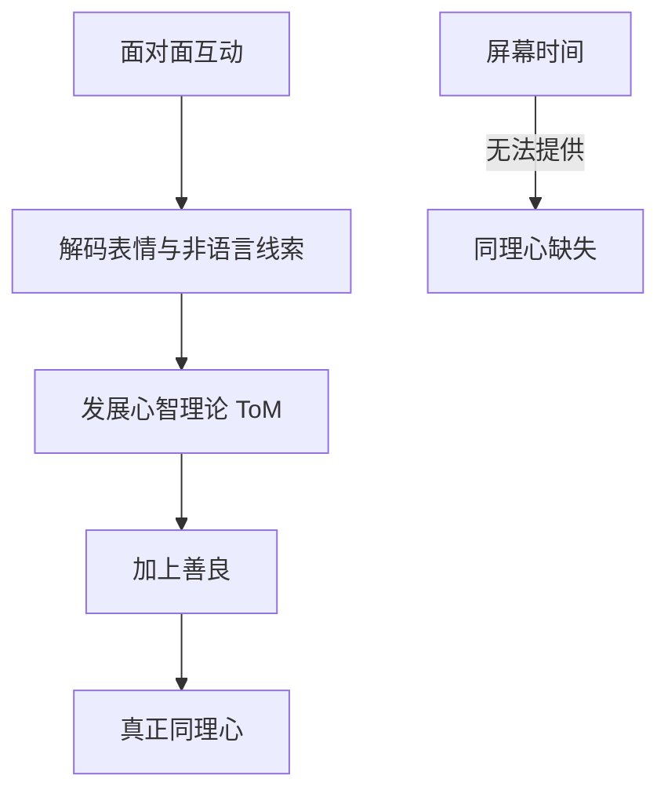

### 2. 走进孩子世界后，先关注“情绪”，再谈别的
- 孩子一切行为背后都有情绪驱动。超级父母的做法是：先命名情绪，再共情情绪，而不是急着说教或否定。
- 正确示范：5岁Jacob没人选他打球，妈妈说：“你看起来很受伤，也很生气，对吗？”而不是“你别哭了，男子汉”。


### 3. 情绪稳定 = 更聪明 + 更快乐 + 更道德
- 情绪调节能力强 → 执行功能（自控、计划）变强 → 成绩更好。
- 情绪稳定 → 更容易交到好朋友 → 成年后更幸福。
- 情绪被看见 → 孩子学会用同理心对待别人 → 道德感自然生长。

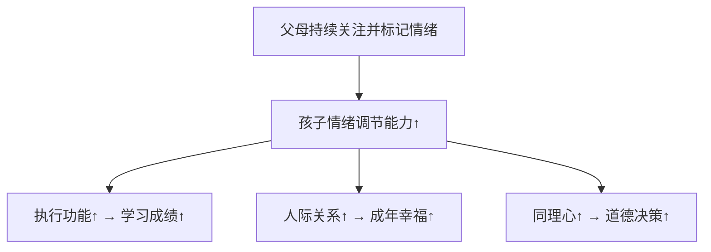

### 4. 好教养的公式：温暖 + 一致的规则
- 只要做到“规律走进孩子的情绪世界 + 用同理心回应 + 同时坚定执行规则”，你就赢了99%的父母。
- 孩子需要边界感，更需要边界里满满的安全感和被理解感。

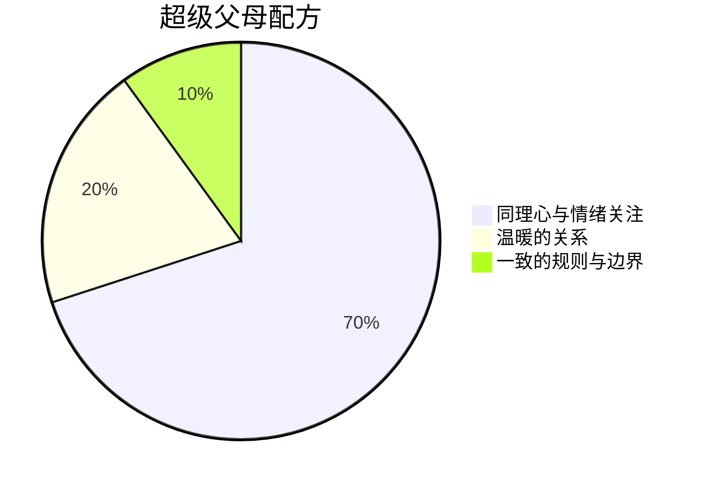

### 5. 孩子也在“养”父母
- 你每一次选择放下自己去理解孩子，其实都在让自己变得更耐心、更善良、更会爱。
- 孩子送给父母的礼物：耳炎→耐心；摔东西→见证个性成长；冷不丁一句“我要减碳水”→笑到哭的幸福。

## 问答

### Q：我已经错过了孩子0-3岁的黄金期，还来得及培养同理心吗？
A：完全来得及！同理心和情绪调节能力是可以终身训练的。只要你现在开始每天练习“读懂孩子情绪 + 命名 + 共情”，几个月就能看到明显变化。

### Q：孩子发脾气时我总是先急着讲道理，为什么没用？
A：因为发脾气时孩子的大脑杏仁核被劫持，前额叶“下线”了，讲道理等于对牛弹琴。先共情把情绪强度降下来（“你现在特别生气，对吗？”），等他平静了再讲道理，效果翻10倍。

### Q：全书最重要的一句话是什么？
A：作者在第265页说：“我原本以为育儿是发展孩子的大脑，其实真正重要的是发展孩子的心（human hearts）。”当你把育儿重点从“教知识”变成“养一颗会爱、会被爱的心”，一切都对了。


## 聪明宝宝：种子 - 大脑规则（感觉安全才能学习）

- 智力50%来自基因，50%来自环境；没有“天才大脑”结构，也没有单一“聪明基因”。婴儿早期行为测试却能准确预测成年IQ，真正的智力更像“妈妈的炖牛肉”：核心是记忆+应变能力，再加上5种关键“配料”就能决定孩子未来是否出色。

- 你能获得：理解孩子智力的真实组成，避免被IQ单一名词迷惑；抓住0-3岁黄金期培养5种关键能力，让孩子未来学业、创造力、情绪控制都大幅领先。

## 核心内容：

### 1. 智力不是由大脑结构决定的
- 爱因斯坦大脑被切片研究后发现：结构和普通人没本质区别，有些区域稍大，有些 glial 细胞多一点，但这些“异常”在普通人身上也很常见。
- 活体脑成像同样找不到“聪明人统一模式”，不同天才解决问题时激活的脑区千差万别。
- 目前没有任何脑成像能预测婴儿是否会成为天才。

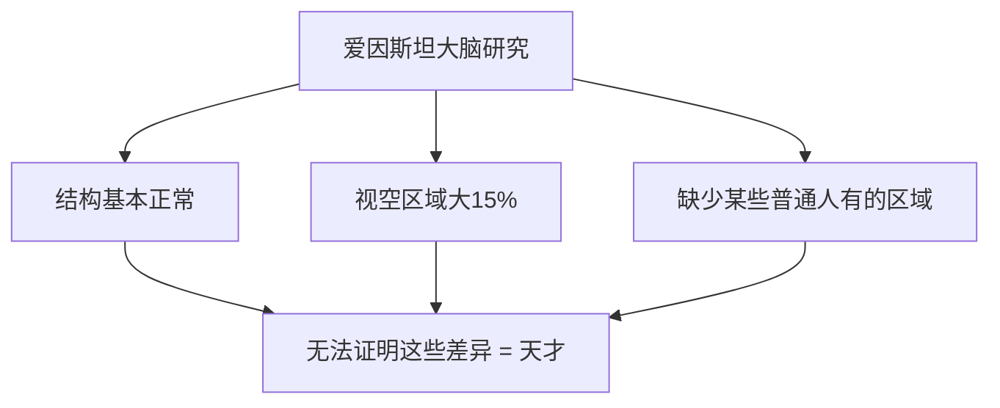

### 2. 没有单一“聪明基因”
- COMT、cathepsin D、多巴胺受体等基因变体只带来3-4分IQ提升，且重复性差。
- 智力太复杂，不可能只有一个主宰基因。

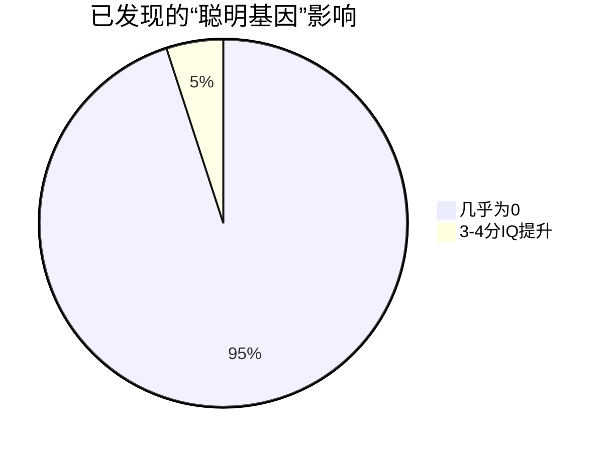

### 3. 婴儿行为测试却能准确预测成年IQ
- 2-8个月婴儿做“跨模态转移”（摸过的东西能认出来）和“视觉识别记忆”（看棋盘格盯得越久越好）测试，能精准预测18岁IQ。
- 这说明婴儿早期信息处理速度和记忆力已奠定未来智力基础。

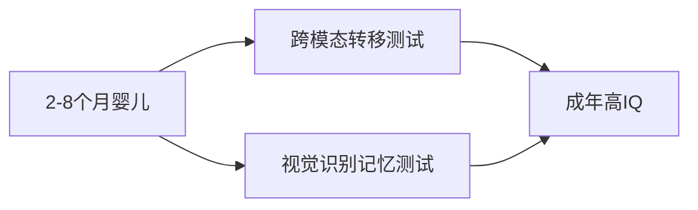

### 4. IQ不是固定不变的“出生日期”
- 美国1947-2002年平均IQ涨了18分（Flynn效应）；
- 贫穷家庭孩子被中产家庭领养，平均IQ涨12-18分；
- 压力、年龄、文化、家庭收入都会大幅波动IQ。
- 执行功能（自控力）比IQ更能预测学业成功。

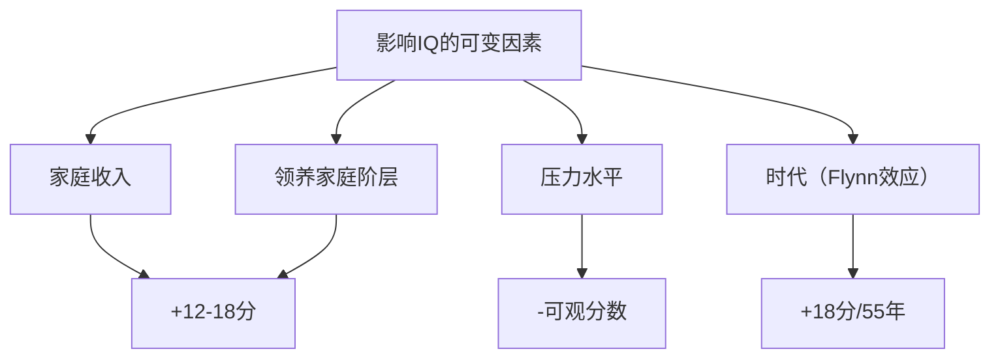

### 5. 智力真正的5种关键“配料”（远比IQ重要）
- 探索欲望 → 自控能力 → 创造力 → 语言沟通 → 解读非语言线索

#### ① 探索欲望（好奇心）
- 婴儿天生就是科学家：观察→预测→实验→修正。
- 哈佛研究：成功创新者最共通特质就是“好奇心”，4岁孩子问最多问题，6岁半后被学校教没。
- 家长要做的：别急着给答案，鼓励孩子自己试错。

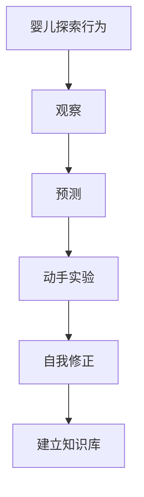

#### ② 自控能力（执行功能）
- 斯坦福“棉花糖实验”：能等15分钟的孩子，长大后SAT高210分。
- 执行功能比IQ更能预测学业成功，因为现代社会干扰太多，需要强大过滤能力。

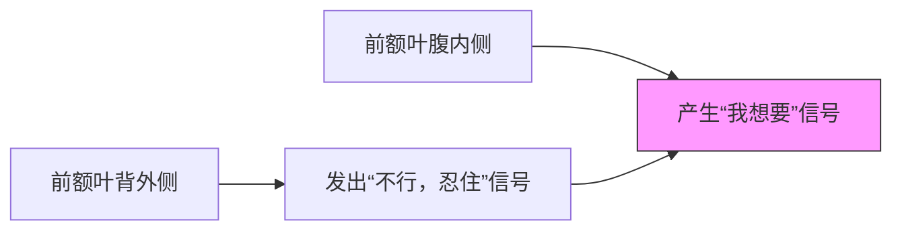

#### ③ 创造力
- 核心 = 看见旧事物的新关系 + 敢于冒险（功能性冲动）。
- Torrance创造力测试预测终身创造成就的相关性是IQ的3倍。
- 创造力在fMRI上表现为前额叶特定区域高度活跃。

```mermaid
radar
    title Torrance创造力测试预测力 vs IQ
    
    axis1: "预测专利数量"
    axis2: "预测出版书籍"
    axis3: "预测创办企业"

    "Torrance测试": [9, 8, 9]
    "IQ测试": [3, 3, 3]

```

#### ④ 语言沟通能力
- 婴儿出生就能分辨全世界所有语言音位，6个月后只保留常听到的语言音位，窗口期极短。
- 家长多说话、多读绘本是最高回报投资。

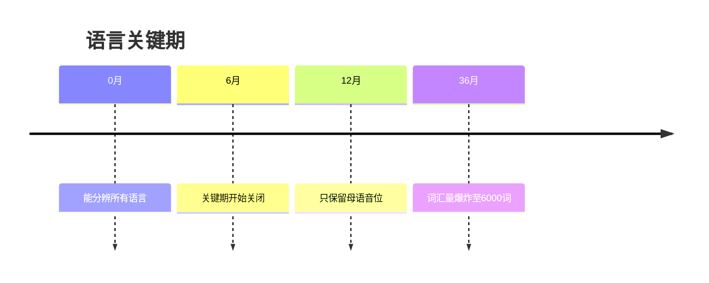

#### ⑤ 解读非语言线索（读懂别人情绪与意图）
- 婴儿几小时大就能模仿成人表情，是社交智力的起点。
- 这项能力决定未来人际关系、领导力、共情力。

## 问答

### Q：怎么判断我的宝宝将来会不会聪明？
A：别看大脑结构、别迷信单一IQ数字。2-8个月做视觉识别记忆和跨模态测试最准；更重要的是观察他好奇心强不强、能不能忍住不立刻抓玩具、敢不敢尝试新东西。

### Q：IQ高就一定成功吗？
A：不一定。执行功能（自控力）和创造力对学业、事业成功的预测力远超IQ。很多高IQ孩子自控力差反而学业平平。

### Q：我能做什么让孩子更聪明？
A：50%基因无法改变，但另外50%完全在你手里：大量亲子对话、鼓励探索、不急着给答案、练习延迟满足、保护好奇心、提供安全稳定的情感环境（感觉安全才能学习）。

### Q：现在流行给幼儿测IQ进名幼儿园，值得吗？
A：不值得。IQ极易受环境影响，而且只测了智力冰山一角。4-6岁测出来的高分很大可能是家庭教育好，而不是孩子天生更聪明。真正决定未来的，是上面5种“炖牛肉配料”。


## 《爱因斯坦从不使用闪卡》（Einstein Never Used Flash Cards）序言与导论

- 这本书用40年儿童发展科学证据告诉父母：孩子不需要昂贵玩具、早教班、闪卡、莫扎特CD，就能自然变聪明。真正决定孩子智力与情商的是“自由玩耍+父母温暖互动”，过度催熟反而让孩子焦虑、厌学、失去创造力。你将获得轻松育儿的科学依据，彻底摆脱“别人家孩子”焦虑。

你能获得：
- 放下内疚，敢于对额外课程说“不”；
- 孩子更快乐、更自信、更有创造力；
- 亲子关系更亲密，家庭生活真正回归乐趣；
- 用科学反击“再不报班就晚了”的恐慌。

## 核心内容：

### 1. 现代父母正陷入“成就崇拜”陷阱
- 社会让父母相信：孩子必须从小被“赶超”，否则就会输在起跑线。
- 结果是孩子日程表排满、自由玩耍时间从1981年的40%降到1997年的25%，40%美国学区甚至取消课间休息。
- 作者（两位顶尖儿童发展心理学家）亲身经历：即使她们知道过度催熟有害，也曾因周围压力而动摇，但最终选择让孩子多玩，结果孩子照样上常春藤、快乐且有创造力。

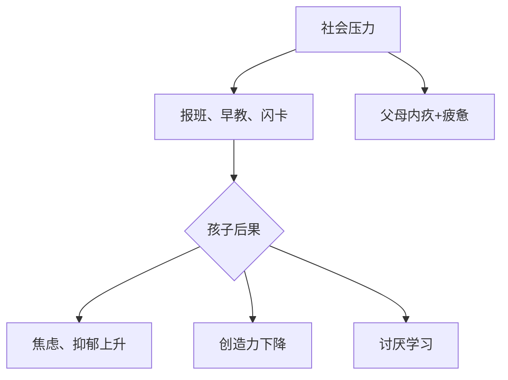

### 2. “玩＝学习”（Play = Learning）是全书核心公式
- 儿童天生就是学习机器，自由玩耍才是他们最强大、最自然的“学习程序”。
- 强迫式早教（闪卡、婴儿数学视频）只制造表演式记忆，真正理解与长期保留几乎为零。
- 自然情境中的玩耍（堆积木、过家家、捉迷藏）同时发展语言、数学、社交、情绪调节、创造力。

```mermaid
pie title 儿童学习的最佳方式
    "自由玩耍+父母陪伴" : 85
    "闪卡/早教班/视频" : 15
```

### 3. 脑科学神话大揭秘：你不是孩子大脑的建筑师
- “前3年决定一生”“错过关键期就完了”“听莫扎特变聪明”“玩具越多大脑越大”全是误读或夸大。
- 大脑发育主要靠进化预设（经验期待型），普通家庭的日常互动已完全足够；过度刺激反而造成“神经拥挤”，可能损害后期创造力。
- 真正的“关键期”只存在于极端剥夺情况下（例如被锁在房间13年的Genie），普通孩子错过婴儿期学钢琴、外语，一样能在5-10岁甚至更晚学得很好。

```mermaid
graph LR
    A[神话：前3年必须疯狂刺激] --> B[事实：大脑自己会长]
    B --> C[普通家庭环境已足够]
    B --> D[过度刺激→神经拥挤→创造力受损]
    A --> E[商家利用父母焦虑卖产品]
```

### 4. 情绪智商（EQ）比智商（IQ）更重要
- 高IQ的人可能人生失败，高EQ的人往往成功且幸福。
- EQ的核心在亲子温暖互动与自由玩耍中自然养成：自我控制、坚持、共情、情绪调节。
- 被赶来赶去的“安排好的孩子”反而缺乏自我驱动与韧性。

```mermaid
graph TD
    EQ[情绪智商 EQ] --> A[自我控制]
    EQ --> B[坚持与热情]
    EQ --> C[共情他人]
    EQ --> D[幸福人生]
    IQ[智商 IQ] --> E[仅能预测学业表现20%]
```

### 5. 父母的新三R原则：Reflect（反思）- Resist（拒绝）- Re-center（重新聚焦）
- 看到耸人听闻的早教广告时，先停下来反思：这真有必要吗？会挤占玩耍时间吗？
- 勇敢拒绝：基于科学说“不”，不是所有别的孩子都在做的你都得做。
- 重新聚焦：把童年的中心归还给玩耍，和孩子一起玩就是最好的“早教”。

```mermaid
graph TD
    A[早教广告/别人家孩子] --> B[Reflect<br>真的必要吗？]
    B --> C[Resist<br>勇敢说不]
    C --> D[Re-center<br>和孩子玩耍]
    D --> E[快乐+真正聪明]
```

### 6. 日常小事就是最好的学习机会
- 分薯条就是在教数学（平均分）；
- 超市排队就是在教耐心与社会规则；
- 玩纸箱、锅碗瓢盆比任何昂贵玩具都更有创造力；
- 陪孩子看同一集《蓝狗线索》10遍，比换10个新节目更有益（孩子爱重复）。

```mermaid
graph TD
    A[日常小事] --> B[分薯条→数学]
    A --> C[纸箱→工程与想象力]
    A --> D[重复看动画→语言与记忆]
    A --> E[一起玩→EQ+亲子关系]
```

## 问答

### Q：听莫扎特真的能让孩子变聪明吗？
A：不能。1993年那篇“莫扎特效应”研究仅发现大学生听10分钟莫扎特后，空间推理测试短暂提升8-10分钟，且多次复现失败。把这夸大成“婴儿听古典音乐变天才”是商家营销，科学界早已辟谣。

### Q：错过0-3岁关键期，孩子是不是就完了？
A：完全不会。大脑发育主要靠进化预设的“经验期待型”机制，普通家庭的爱与互动已足够。语言、音乐等“经验依赖型”技能学习窗口至少开到青春期，甚至终身可学。极端剥夺（如被锁13年）才会造成不可逆伤害。

### Q：不报早教班、不用闪卡，孩子上小学会不会跟不上？
A：不会。大量研究显示：学术型幼儿园的孩子短期看似领先，但到小学一年级就与玩耍型幼儿园的孩子完全没有差距；反而玩耍型孩子更少焦虑、更有创造力、更爱学习。

### Q：我已经给孩子报了很多班，怎么办？
A：立刻践行“新三R”：反思哪些班真正让孩子开心且有兴趣，勇敢砍掉大部分，把时间还给自由玩耍。家长最大的焦虑来源往往是“别人都在做”，但科学告诉你：少即是多，玩耍才是王道。


## 《爱因斯坦从不使用闪卡》（Einstein Never Used Flash Cards）序言与导论

- 这本书用40年儿童发展科学证据告诉父母：孩子不需要昂贵玩具、早教班、闪卡、莫扎特CD，就能自然变聪明。真正决定孩子智力与情商的是“自由玩耍+父母温暖互动”，过度催熟反而让孩子焦虑、厌学、失去创造力。你将获得轻松育儿的科学依据，彻底摆脱“别人家孩子”焦虑。

你能获得：
- 放下内疚，敢于对额外课程说“不”；
- 孩子更快乐、更自信、更有创造力；
- 亲子关系更亲密，家庭生活真正回归乐趣；
- 用科学反击“再不报班就晚了”的恐慌。

## 核心内容：

### 1. 现代父母正陷入“成就崇拜”陷阱
- 社会让父母相信：孩子必须从小被“赶超”，否则就会输在起跑线。
- 结果是孩子日程表排满、自由玩耍时间从1981年的40%降到1997年的25%，40%美国学区甚至取消课间休息。
- 作者（两位顶尖儿童发展心理学家）亲身经历：即使她们知道过度催熟有害，也曾因周围压力而动摇，但最终选择让孩子多玩，结果孩子照样上常春藤、快乐且有创造力。

```mermaid
graph TD
    A[社会压力] --> B[报班、早教、闪卡]
    B --> C{孩子后果}
    C --> D[焦虑、抑郁上升]
    C --> E[创造力下降]
    C --> F[讨厌学习]
    A --> G[父母内疚+疲惫]
```

### 2. “玩＝学习”（Play = Learning）是全书核心公式
- 儿童天生就是学习机器，自由玩耍才是他们最强大、最自然的“学习程序”。
- 强迫式早教（闪卡、婴儿数学视频）只制造表演式记忆，真正理解与长期保留几乎为零。
- 自然情境中的玩耍（堆积木、过家家、捉迷藏）同时发展语言、数学、社交、情绪调节、创造力。

```mermaid
pie title 儿童学习的最佳方式
    "自由玩耍+父母陪伴" : 85
    "闪卡/早教班/视频" : 15
```

### 3. 脑科学神话大揭秘：你不是孩子大脑的建筑师
- “前3年决定一生”“错过关键期就完了”“听莫扎特变聪明”“玩具越多大脑越大”全是误读或夸大。
- 大脑发育主要靠进化预设（经验期待型），普通家庭的日常互动已完全足够；过度刺激反而造成“神经拥挤”，可能损害后期创造力。
- 真正的“关键期”只存在于极端剥夺情况下（例如被锁在房间13年的Genie），普通孩子错过婴儿期学钢琴、外语，一样能在5-10岁甚至更晚学得很好。

```mermaid
graph LR
    A[神话：前3年必须疯狂刺激] --> B[事实：大脑自己会长]
    B --> C[普通家庭环境已足够]
    B --> D[过度刺激→神经拥挤→创造力受损]
    A --> E[商家利用父母焦虑卖产品]
```

### 4. 情绪智商（EQ）比智商（IQ）更重要
- 高IQ的人可能人生失败，高EQ的人往往成功且幸福。
- EQ的核心在亲子温暖互动与自由玩耍中自然养成：自我控制、坚持、共情、情绪调节。
- 被赶来赶去的“安排好的孩子”反而缺乏自我驱动与韧性。

```mermaid
graph TD
    EQ[情绪智商 EQ] --> A[自我控制]
    EQ --> B[坚持与热情]
    EQ --> C[共情他人]
    EQ --> D[幸福人生]
    IQ[智商 IQ] --> E[仅能预测学业表现20%]
```

### 5. 父母的新三R原则：Reflect（反思）- Resist（拒绝）- Re-center（重新聚焦）
- 看到耸人听闻的早教广告时，先停下来反思：这真有必要吗？会挤占玩耍时间吗？
- 勇敢拒绝：基于科学说“不”，不是所有别的孩子都在做的你都得做。
- 重新聚焦：把童年的中心归还给玩耍，和孩子一起玩就是最好的“早教”。

```mermaid
graph TD
    A[早教广告/别人家孩子] --> B[Reflect<br>真的必要吗？]
    B --> C[Resist<br>勇敢说不]
    C --> D[Re-center<br>和孩子玩耍]
    D --> E[快乐+真正聪明]
```

### 6. 日常小事就是最好的学习机会
- 分薯条就是在教数学（平均分）；
- 超市排队就是在教耐心与社会规则；
- 玩纸箱、锅碗瓢盆比任何昂贵玩具都更有创造力；
- 陪孩子看同一集《蓝狗线索》10遍，比换10个新节目更有益（孩子爱重复）。

```mermaid
graph TD
    A[日常小事] --> B[分薯条→数学]
    A --> C[纸箱→工程与想象力]
    A --> D[重复看动画→语言与记忆]
    A --> E[一起玩→EQ+亲子关系]
```

## 问答

### Q：听莫扎特真的能让孩子变聪明吗？
A：不能。1993年那篇“莫扎特效应”研究仅发现大学生听10分钟莫扎特后，空间推理测试短暂提升8-10分钟，且多次复现失败。把这夸大成“婴儿听古典音乐变天才”是商家营销，科学界早已辟谣。

### Q：错过0-3岁关键期，孩子是不是就完了？
A：完全不会。大脑发育主要靠进化预设的“经验期待型”机制，普通家庭的爱与互动已足够。语言、音乐等“经验依赖型”技能学习窗口至少开到青春期，甚至终身可学。极端剥夺（如被锁13年）才会造成不可逆伤害。

### Q：不报早教班、不用闪卡，孩子上小学会不会跟不上？
A：不会。大量研究显示：学术型幼儿园的孩子短期看似领先，但到小学一年级就与玩耍型幼儿园的孩子完全没有差距；反而玩耍型孩子更少焦虑、更有创造力、更爱学习。

### Q：我已经给孩子报了很多班，怎么办？
A：立刻践行“新三R”：反思哪些班真正让孩子开心且有兴趣，勇敢砍掉大部分，把时间还给自由玩耍。家长最大的焦虑来源往往是“别人都在做”，但科学告诉你：少即是多，玩耍才是王道。


## 《How Toddlers Thrive》幼儿大脑的快速发展：他们到底为什么这么做


## 莎拉·杰西卡·帕克序言

- 大明星莎拉·杰西卡·帕克分享育儿心路：从8个孩子的大家庭长大，到自己生3个孩子时过度焦虑、觉得自己做得不够好，直到遇见托瓦·克莱因，才明白“放手”才是最好的爱。克莱因教会她：给孩子空间、让他们自己解决问题，才是真正培养自信与能力的正道。

- 你能获得：从焦虑到自信的育儿转变；学会不替孩子包办一切；理解每个孩子都不同，不再自我评判；让孩子从小拥有真正的安全感和自我价值。

## 核心内容：

### 1. 大家庭长大的孩子反而更独立自信
- 大家庭里父母无法事事管到，孩子自然学会自己解决问题、互相照顾，反而建立了强大的自我感和自信。
- 现代小家庭父母容易过度介入，反而剥夺了孩子发展独立性的机会。

```mermaid
graph TD
  A[大家庭育儿] --> B[父母分身乏术]
  B --> C[孩子被迫自己解决问题]
  C --> D[建立自我价值感]
  C --> E[学会独立与合作]
  D --> F[真正的自信]
```

### 2. 过度保护和“帮孩子搞定一切”是最大的伤害
- 父母一看到孩子困难就冲上去“修复”，孩子会失去自己面对问题、尝试错误、最终解决问题的宝贵经验。
- 真正的爱是陪在旁边，但让孩子自己去经历挫折和成功。

```mermaid
graph LR
  A[孩子遇到困难] -->|父母立刻解决| B[孩子错失成长机会]
  A -->|父母陪伴但不插手| C[孩子学会问题解决]
  C --> D[自信 + 能力 + 韧性]
```

### 3. 没有“唯一正确”的育儿方式，也没有“标准”的童年
- 每个孩子天生不同：外向的、黏人的、直来直去的，都正常。
- 强行用同一种方式对待不同孩子，或拿自己的孩子跟别人比，只会让孩子感到羞耻。

```mermaid
pie title 孩子个性分布
  "外向活泼" : 33
  "分离焦虑严重" : 33
  "直率干脆" : 34
```

### 4. 给选择，但不能给无限选择
- 2-3岁的孩子需要边界内的自由，而不是完全放任。
- 例如：今天穿红衣服还是蓝衣服？（2个选项），而不是“你想穿什么就穿什么”。

```mermaid
graph TD
  A[给选择] --> B[只有2-3个明确选项]
  B --> C[孩子感到被尊重]
  B --> D[同时维持秩序]
  A -->|选项太多| E[孩子反而焦虑崩溃]
```

### 5. 父母的自我评判会传染给孩子羞耻感
- 当妈妈觉得自己“做得不够好”，孩子会接收到“我不够好”的信号。
- 停止自我苛责，孩子才会停止自我怀疑。

```mermaid
graph LR
  A[妈妈：我是不是个坏妈妈？] --> B[孩子接收到：我是不是让妈妈失望了？]
  A[妈妈：我在尽力，这就够了] --> C[孩子接收到：我被无条件接纳]
```

## 问答

### Q: 为什么大家庭的孩子反而更自信？
A: 因为父母无法事事照顾到，孩子从小被迫自己解决问题、照顾弟妹，自然建立起“我能行”的强大自我感。

### Q: 父母总是帮孩子解决问题会有什么坏处？
A: 孩子会失去练习解决问题的机会，长大后一遇到困难就崩溃或过度依赖别人，自信心和能力都受损。

### Q: 怎么理解“没有唯一正确的育儿方式”？
A: 每个孩子气质天生不同，同样的方法对一个孩子有效，对另一个可能适得其反。尊重个体差异，不评判自己也不评判孩子，才是真正的接纳。

### Q: 给两三岁孩子选择时，为什么不能给太多选项？
A: 选项太多会让幼儿的大脑超载，导致焦虑、拖延甚至崩溃。2-3个清晰选项既给孩子自主感，又维持秩序。
用50字总结：  
1-3岁是孩子大脑爆炸式成长的阶段，他们的情绪失控、固执己见、反复无常，其实是大脑在拼命学习自我控制、情绪调节和人际关系。如果现在理解并正确引导，就能奠定孩子一生的情绪健康和成功基础。

你能获得的令人心动的收获：
- 彻底读懂孩子所有“不可理喻”行为背后的科学原因
- 再也不用跟孩子硬碰硬，而是用大脑友好的方式轻松带娃
- 帮助孩子建立强大内在安全感、自我控制力和社交能力
- 让孩子未来更自信、更快乐、学习能力更强

## 核心内容

### 1. 1-3岁是大脑最剧烈的重塑期，前额叶正在疯狂发育
- 详细解释：幼儿的前额叶（负责自我控制、情绪调节、计划、理性思考的区域）在1-3岁期间突触增长达到巅峰，但同时也在大规模“修剪”，所以孩子会同时表现出“突然懂事”和“突然失控”两种极端状态。
- 举例：孩子明明会说“等一下”，但一想要玩具就立刻崩溃，这是因为前额叶还没能稳定压制杏仁核（情绪中心）。
```mermaid
graph TD
    A[杏仁核<br/>情绪中心<br/>已成熟] -->|强烈信号| B[前额叶<br/>控制中心<br/>正在发育中]
    B -->|抑制失败| C[情绪爆发<br/>哭闹、打人、摔东西]
    B -->|抑制成功| D[平静等待<br/>用语言表达]
```

### 2. 幼儿的行为99%是由情绪驱动，而非故意对抗
- 详细解释：这个年龄的孩子几乎没有能力用理性控制冲动，他们的行为是被底层情绪系统（恐惧、愤怒、渴望联结）直接驱动的。我们看到“故意捣蛋”，其实是孩子在用尽全力表达“我现在非常需要你帮助我冷静”。
- 行动建议：把每一次“失控”都翻译成孩子在说“我的大脑现在被情绪淹没了，快来救我”。

```mermaid
graph LR
    Trigger[触发事件<br/>玩具被抢] --> Emotion[强烈情绪<br/>恐惧/愤怒] --> Behavior[尖叫、打人、躺地]
    Emotion --> Need[真实需求<br/>需要安全感与共情]
```

### 3. 他们极度需要“共同调节”（co-regulation），自己还不会“自我调节”
- 详细解释：幼儿的神经系统还没有自我安抚的能力，必须通过和安全依恋对象（主要是父母）的身体接触、声音、表情来借用成年人的冷静神经系统，才能慢慢平静。
- 举例：孩子摔倒大哭时，抱起来轻拍、用平稳声音说话，比任何讲道理都有效100倍。
- 行动建议：把“抱一下”“我陪着你”当成第一反应，而不是先批评或命令停止哭泣。

```mermaid
graph TD
    A[孩子情绪失控] --> B[父母保持冷静<br/>拥抱 + 平稳声音]
    B --> C[共同调节<br/>孩子借用父母的神经系统]
    C --> D[孩子逐渐平静<br/>大脑学会自我调节模板]
```

### 4. “不！”是幼儿正在建立自我边界感和自我意识的健康表现
- 详细解释：1.5-3岁是孩子第一次意识到“我”和“你”是分开的人，这个阶段频繁说“不”、拒绝穿衣吃饭，是在练习自主性和边界感，是大脑发育的必经阶段。
- 行动建议：尊重但不完全顺从，给有限选择（“要红杯子还是蓝杯子？”）比强迫或完全放任都更好。

```mermaid
pie title 应对“不！”的正确方式
    "强迫服从" : 20
    "完全放任" : 15
    "提供有限选择" : 65
```

### 5. 反复无常、情绪像过山车，是大脑左右脑整合尚未完成的正常现象
- 详细解释：左脑负责逻辑和语言，右脑负责情绪和整体感受。幼儿阶段左右脑连接（胼胝体）还在发育，所以孩子可能上一秒还笑着，下一秒就崩溃。
- 举例：孩子玩得好好的，突然因为鞋带颜色不对就崩溃，这不是矫情，是右脑情绪风暴压倒了左脑理性。
- 行动建议：先接住情绪（“我看到你很生气”），等右脑平静后再用左脑讲道理。

### 6. 这个阶段的教养核心不是“管教”，而是“建立安全依恋 + 温和引导”
- 详细解释：安全依恋是孩子一生心理健康的最强保护因子。温暖、有回应、稳定可预测的看护者，能让孩子大脑分泌更多催产素和血清素，减少未来焦虑、抑郁风险。
- 行动建议：每天至少10分钟专属亲子时光（无手机、无批评、跟随孩子兴趣），是最高回报的投资。

```mermaid
graph TD
    A[安全依恋] --> B[大脑催产素↑<br/>压力激素↓]
    B --> C[未来更强的情绪调节力]
    B --> D[更高的学习能力和社交能力]
    B --> E[更低的焦虑抑郁风险]
```

## 问答

### Q：孩子突然发脾气，是在故意气我吗？
A：不是。1-3岁孩子完全没有能力“故意气人”，他们的前额叶还没发育好，情绪一来就像洪水冲垮堤坝，根本控制不住。

### Q：为什么同样的方法对大宝有效，对小宝完全没用？
A：每个孩子的神经系统敏感度和气质不同，有的孩子需要更多身体接触，有的需要更多语言安抚。关键是观察这个孩子当下最需要什么，而不是套用“标准答案”。

### Q：孩子总说“不”，是不是管教太松了？
A：不是。频繁说“不”是2岁左右孩子的正常发育任务，说明他正在建立自我意识。只要父母保持温暖坚定（不打骂、不羞辱、不完全顺从），这个阶段会自然过去。

### Q：我抱孩子时他还哭，是不是抱错了？
A：不是。刚开始共同调节时，孩子可能哭得更厉害，这是因为压抑很久的情绪终于找到出口而“宣泄”。坚持抱住、轻声重复“我在，我陪着你”，通常5-15分钟就会平静。


## 第一章：让幼儿茁壮成长——自我调节是真正成功的关键

- 幼儿行为看似“疯癫”，其实是大脑快速发育的正常表现：一会儿独立自信、一会儿崩溃依赖，都是他们在努力适应这个巨大世界。你能获得：不再被情绪崩溃搞崩溃，真正理解孩子行为背后的需求，从此带娃更从容、更有效，奠定孩子一生幸福与成功的根基。

## 核心内容：

### 1. 幼儿行为充满矛盾（Toddler Paradox），其实是大脑发育阶段的正常现象
- 幼儿大脑情感中枢比理性中枢发育早、反应快，所以情绪像过山车：前一秒开心穿衣，后一秒因没粉色冰雪而崩溃。
- 他们活在“现在”，不会提前思考后果，只想同时被爱、被照顾，又要独立。
- 表面“没道理”的发脾气，其实是孩子在表达：我有时觉得自己能掌控世界，有时又被世界吓到。

```mermaid
graph TD
    A[幼儿大脑] --> B[情感中枢成熟快]
    A --> C[理性前额叶发育慢]
    B --> D[情绪瞬间爆炸]
    C --> E[无法自我安抚]
    D & E --> F[行为极端矛盾]
```

### 2. 幼儿真正需要的是“安全感+自由+界限”的平衡，而不是控制或放任
- 过度控制会扼杀独立性；完全放任会让孩子缺乏安全感。
- 最好的养育是在孩子需要时及时出现提供安慰，在孩子想探索时退后一步给予空间，同时坚持必要界限。
- 这三者缺一不可，才是大脑健康发育的必需营养。

```mermaid
pie title 幼儿健康成长三要素
    "安全感与陪伴" : 40
    "探索自由" : 35
    "清晰界限" : 25
```

### 3. 自我调节（Self-Regulation）是一生成功最重要的能力，幼儿期正是打地基的黄金期
- 自我调节包括：管理情绪、专注注意力、延迟满足、从挫折中恢复、解决问题等。
- 这些能力比智商更能预测未来学业、健康、人际与幸福感。
- 幼儿大脑前额叶还在建“情绪-理性连接”，需要成千上万次父母的共情+引导才能建成。

```mermaid
graph LR
    A[父母反复共情与引导] --> B[1000+次小互动]
    B --> C[大脑建立情绪-理性连接]
    C --> D[自我调节能力形成]
    D --> E[一生成功与幸福]
```

### 4. 父母是孩子的“外置前额叶”，幼儿崩溃时需要我们先帮他们调节
- 2-5岁孩子自己还管不住情绪，我们要借给他们冷静的大脑：先接纳情绪，再协助思考。
- 每一次你陪孩子命名情绪、一起深呼吸、提供选择，其实都在帮大脑布线。
- 重复几千次后，孩子就会自己说：“我很生气，但我可以先抱抱熊再告诉你。”

```mermaid
graph TD
    A[孩子情绪失控] --> B{父母反应}
    B --> C[批评/惩罚/忽视]
    B --> D[共情+命名情绪+引导]
    C --> E[大脑连接更弱]
    D --> F[大脑连接增强]
    F --> G[未来能自我调节]
```

### 5. 允许孩子犯错、挣扎、失败，是培养韧性与自信的必经之路
- 幼儿通过反复试错建立“我能行”的信念。
- 父母急着纠正或代劳，其实在传递“你不行”的信息。
- 真正的爱是陪着他们感受挫败，但不抢走他们再试一次的机会。

```mermaid
graph TD
    A[孩子尝试新事物] --> B[失败/挫折]
    B --> C{父母反应}
    C --> D[立刻帮忙/批评]
    C --> E[陪伴情绪+鼓励再试]
    D --> F[孩子放弃]
    E --> G[孩子坚持→成功→自信]
```

### 6. 父母要做的六件最重要的事（全书核心框架）
- ① 传递安全与秩序感；② 真正倾听而非只指令；③ 给予自由玩耍与探索；④ 允许挣扎与失败；⑤ 理解每个孩子的独特性；⑥ 提供清晰界限与引导。

```mermaid
graph TD
    A[父母六大关键做法] --> B[传递安全感]
    A --> C[认真倾听]
    A --> D[自由探索]
    A --> E[允许失败]
    A --> F[理解个体]
    A --> G[设立界限]
    B & C & D & E & F & G --> H[孩子自我调节能力茁壮成长]
```

## 问答

### Q：为什么我家孩子前一秒还好好的，突然就崩溃大哭？
A：因为幼儿大脑的情感中枢比理性中枢成熟得早、反应快，情绪像被直接点燃。看到书里粉色冰激凌→立刻“想要”→得不到→情绪爆炸，整个过程可能不到5秒，这是发育阶段的正常现象，不是孩子故意闹。

### Q：自我调节到底有多重要？
A：比智商、家庭背景更能预测一生幸福与成功。研究显示，幼儿期自我调节能力强的孩子，长大后学业更好、身体更健康、犯罪率更低、收入更高、婚姻更幸福。

### Q：我该怎么帮孩子发展自我调节？
A：每次孩子情绪失控时，先共情（“你很想要粉色冰激凌，生气了对吗？”），再帮他们命名情绪、深呼吸、提供小选择（“现在我们可以抱抱，或者数到10再说话”）。重复几千次，大脑就学会了自己这样做。

### Q：孩子犯错、摔倒、做不好，我要不要马上帮忙？
A：尽量忍住先帮忙的冲动。先问：“需要我帮忙吗？”大部分时候他们会说“不要，我自己！”允许他们挣扎、失败、再尝试，是建立自信与韧性的唯一途径。

### Q：这本书跟一般的“管教技巧”书有什么不一样？
A：不教你如何“控制”孩子，而是教你理解孩子行为背后的真实需求。不是让孩子听话，而是帮孩子建立一生受用的内在调节能力。父母从“对手”变成“盟友”，带娃立刻从战争变成合作。


## 第二章　幼儿悖论：为什么他们一会儿把你拉近，一会儿又推开

- 2-5岁幼儿的行为看似矛盾，其实是正常发育现象：他们既渴望独立，又极度需要父母的安慰和安全感。这种“推拉冲突”是这个年龄的核心特征，理解它就能从此告别“孩子莫名其妙发脾气”的困惑。

- 你将获得：不再被孩子的情绪牵着鼻子走、减少80%的亲子冲突真正读懂孩子行为背后的真实需求让孩子既大胆探索世界，又拥有强大内心安全感。

## 核心内容：

### 1. 幼儿的“推拉悖论”是大脑发育的必然结果
- 2-5岁孩子正处于“分离-个体化阶段：他们一边想“我要自己来”，一边又害怕离开父母这个“安全基地”。
- 大脑的情绪调节区（前额叶）还没发育成熟，所以他们无法很好地控制强烈情绪，只能用大哭、发脾气、说反话来表达。
- 表面看起来很凶、很独立的孩子，内心往往正感到孤独、嫉妒、害怕被抛弃（Xavier穿超人披风发脾气，其实是因为想外婆和表姐）。


```mermaid
graph TD
    A["安全依附<br/>(0-1岁)"] --> B["移动能力爆发<br/>(1-2岁开始)"]
    B --> C["探索世界<br/>(我要自己来)"]
    C --> D["情绪大脑不成熟<br/>(害怕、愤怒、失控)"]
    D --> E["推开父母<br/>(发脾气、说不要你)"]
    E --> F["其实需要<br/>(立刻被抱、被安慰)"]

    style E fill:#ffcccc
    style F fill:#ccffcc


```

### 2. 孩子必须先“安全依附”，才能勇敢分离
- 婴儿期建立的“安全型依附”是孩子敢探索世界的前提：只有确信“妈妈永远在我身后”，孩子才敢往前跑。
- 推得越凶的孩子，往往是越需要你立刻拉回来抱一下、确认“你还在”。

```mermaid
graph LR
    A[父母可靠回应<br/>婴儿需求] --> B[孩子内心形成<br/>“安全基地”] 
    B --> C[敢独自爬远<br/>探索新事物]
    C --> D[摔倒/害怕时<br/>快速跑回父母怀里]
    D --> E[被安慰后<br/>再次充满电出发]
    style B fill:#ccffcc
```

### 3. “大一下小一下”是这个年龄的常态
- 今天要自己穿鞋、说明天又要你喂饭昨天爱吃香蕉、今天看见就尖叫这些都不是孩子故意气你，而是他在反复练习“我到底是大孩子还是小宝宝”。
- 父母越能接纳这种波动，孩子越快建立稳定的自我感。

```mermaid
graph TD
    A[感觉自己很大<br/>我要自己来!] --> B[遇到挫折<br/>或累了] --> C[瞬间变小<br/>超级黏人宝宝] 
    C --> D[被抱一下<br/>被理解后] --> A
    style A fill:#ffeb3b
    style C fill:#2196f3
```

### 4. 负面情绪和崩溃是健康的，必须允许
- 发脾气、哭闹、打人不是“坏孩子”，而是孩子在用仅有的方式宣泄巨大情绪。
- 父母的任务不是立刻制止，而是翻译：“你现在很生气/很难过，对吗？”承认情绪后，孩子反而能更快平静。

```mermaid
flowchart LR
    A[孩子情绪爆炸] --> B{父母反应}
    B -->|批评/惩罚| C[孩子更愤怒<br/>关系受损]
    B -->|命名+接纳情绪| D[孩子感到被理解<br/>快速平静]
    B -->|抱住+共情| E[孩子学会<br/>情绪可以被安抚]
```

### 5. 设定清晰界限反而让孩子更自由探索
- 孩子越想独立，越需要父母提供“安全围栏”。
- 没有界限的孩子会更焦虑、更黏人，因为他不确定哪里是尽头。

```mermaid
pie title 孩子的安全感来源
  "清晰界限" : 40
  "父母情绪稳定" : 30
  "被无条件接纳" : 30
```

### 6. 每一次“推开后被拉回”都在帮孩子建立终生安全感
- 孩子推开你→你依然温柔坚定地守住他→他重新靠近，这是在大脑里反复刻录：“不管我多坏、多推开爸爸妈妈，他们都不会离开我。”
- 这种经历越多，孩子长大后越敢冒险、越有韧性。

```mermaid
sequenceDiagram
    孩子->>父母: 我不要你！走开！
    父母->>孩子: 我知道你现在很生气，我就在这里等你。
    Note over 父母,孩子: 孩子继续闹…
    孩子->>父母: （崩溃大哭）抱抱…
    父母->>孩子: 来，妈妈抱！没事了。
    孩子->>父母: （平静后又跑去玩）
    Note right of 孩子: 内心+1安全感
```

### 7. 理解每个孩子的独特气质，别拿来比较
- 有的孩子天生胆大、有的敏感慢热、有的情绪外放、有的闷在心里，全都正常。
- 父母越能看见孩子的“个性风格”，越能对症下药，而不是用统一标准要求。

## 问答

### Q：孩子一会儿说“不要我，一会儿又黏着我，是在操纵我吗？
A：不是操纵，是2-5岁孩子的天性。他们正在练习“我是一个独立的人”，但同时又害怕真的失去你。这种推拉越激烈，往往说明孩子越需要你做他的“安全基地”。

### Q：孩子发脾气越来越大，是我太宠他了吗？
A：不一定。2-5岁是情绪爆发高峰期，因为大脑情绪区超活跃、而调控区还没长好。发脾气是正常的宣泄方式，父母越能平静接纳并命名情绪（“你很生气对吗？”），孩子越快能帮孩子学会自我安抚。

### Q：孩子今天能自己穿衣服，明天又完全不会了，是退步了吗？
A：不是退步，是在做“大-小”切换实验。他需要反复确认：我长大了，但当我需要时，爸爸妈妈还会像对待宝宝一样爱我吗？只要你持续给予安慰，这种波动会自然减少。

### Q：我已经很累了，实在抱不动正在发脾气的孩子，怎么办？
A：先深呼吸，告诉自己：这不是针对我，是孩子的情绪太大了。你可以先说“我知道你现在你很需要我，我就在你旁边”，等自己冷静后再抱。修复关系永远比当时“赢”重要。

### Q：孩子一到新环境就哭着找我，是分离焦虑吗？严重吗？
A：2-5岁出现分离焦虑非常常见，尤其是气质敏感的孩子。只要平时依附关系是安全的，这种焦虑会随着年龄自然减退。关键是离别时温柔而坚定地告别，接回时热情迎接，让他确信“你去哪儿我都会回来接你”。


## 第三章：从幼儿的视角看世界（Toddler’s-Eye View）

- 用幼儿的视角看世界，能瞬间理解孩子为什么“突然不听话”、为什么扔东西、为什么黏人又推开你。掌握这5个步骤，父母从崩溃边缘变冷静权威，亲子冲突大幅减少，孩子更安全、更自信。

- 你能获得：每天少吵几次架、孩子更配合、你更享受带娃的时光，还能为孩子未来情绪稳定、自制力强打下关键基础。

## 核心内容：

### 1. 站在孩子的视角：世界对幼儿来说是全新、巨大、充满好奇又吓人的
- 幼儿没有时间概念、因果逻辑，一切都是“当下就要”。大人觉得“睡觉是结束一天”，孩子却觉得“又要和你分开”，所以哭闹不是故意闹你，而是真的害怕分离。
- 扔玩具、爬高、反复要“一件事再做一次”，不是挑衅，而是探索“我能做到什么”“爸爸妈妈会怎么反应”。
- 行动建议：下次孩子“无理取闹”时，先蹲下来和他一样高，问自己“如果我只有80cm高、才活了1000多天，我会怎么看这件事？”

```mermaid
graph TD
    A[成人视角] -->|逻辑+时间感| B[睡觉 = 放松时间]
    C[幼儿视角] -->|无时间感+分离焦虑| D[睡觉 = 又要和妈妈分开]
    style C fill:#ffcccc
    style D fill:#ffcccc
```

### 2. 步骤1：保持亲近，即使孩子推开你（Stay Close, Even When It’s Hard）
- 幼儿一边要独立一边怕孤独，最需要“无论我多坏，你还在我身边”的确定感。
- 即使他大喊“走开！”，也要平静地说“我就在这里，你生气我也在”。
- 这样做的结果：孩子真正发泄完情绪后，会主动靠过来，信任感暴增。

```mermaid
graph LR
    A[孩子推开你] --> B{父母反应}
    B -->|生气走开| C[孩子更焦虑→更闹]
    B -->|平静留在旁边| D[孩子安心→更快平静]
```

### 3. 步骤2：你才是掌舵人（You’re in Charge）
- 幼儿需要你设限，不是商量，而是明确告诉他“这个不可以，因为会受伤”。
- 温柔无效时，必须果断身体介入（如抱离危险处），语气坚定但不吼叫。
- 设限不是伤害孩子，而是让他知道“妈妈会保护我”，反而建立权威和安全感。

```mermaid
stateDiagram-v2
    [*] --> 测试界限
    测试界限 --> 温柔提醒3次
    温柔提醒3次 --> 仍继续
    仍继续 --> 果断身体阻止+清楚说不
    果断身体阻止+清楚说不 --> 孩子短暂生气
    孩子短暂生气 --> 很快恢复信任
```

### 4. 步骤3：保持一致（大部分时候）（Be Consistent, Mostly）
- 幼儿没时间感，靠“每天差不多一样”的作息建立安全感。
- 固定作息（吃饭→洗澡→读书→睡觉）就像给孩子一个隐形日历，让他知道“接下来会发生什么”。
- 偶尔打破没关系，关键是尽快回到老规矩，孩子反而学会灵活。

```mermaid
pie title 一天作息像一个安全圈
    "固定作息（80%）" : 80
    "偶尔变化（20%）" : 20
```

### 5. 步骤4：现实一点（Be Realistic）
- 2岁扔食物、3岁突然尿裤子、4岁出门磨蹭，都是正常波动和倒退。
- 进步后倒退，往往是因为孩子在“大一步”的同时又害怕“离开你太远”。
- 接受“今天会了明天可能又不会”，别把偶尔的失控当失败。

```mermaid
graph TD
    A[向前大步<br>（如戒尿布）] --> B[同时感到害怕]
    B --> C[倒退行为<br>（如尿裤子、要奶嘴）]
    C --> D[父母若理解并包容]
    D --> E[孩子再次安心向前]
```

### 6. 步骤5：划清界限，包括你自己的情绪界限（Make the Boundaries Clear）
- 孩子不是缩小版你，他可能和你性格完全相反（你外向他内向、你好强他温和）。
- 父母要把自己的童年创伤、期望、偏见分开，别把孩子的行为解读成“和我作对”。
- 先问自己“这件事到底触发了我什么？”再回应孩子。

```mermaid
graph TD
    A[孩子行为] --> B{父母第一反应}
    B -->|直接带入自己童年| C[过度反应/控制或放任]
    B -->|先觉察自己情绪| D[看清孩子真实需要]
    D --> E[恰当回应]
```

### 7. 好父母不是完美，而是“够好”（Good Enough Parenting）
- 允许孩子生气、难过、失败，也允许自己偶尔失控。
- 关键是失控后修补：向孩子道歉、抱抱他、告诉他“你发脾气我还是爱你”。
- 孩子从中学会：情绪来了不会世界末日，关系不会断。

```mermaid
graph LR
    A[孩子失控] --> B[父母也失控]
    B --> C[事后修补<br>抱抱+道歉+解释]
    C --> D[关系更紧密<br>孩子更敢表达情绪]
```

## 问答

### Q：孩子总说“不要你！”我该走开还是硬贴着？
A：别走开，也别硬贴。平静地说“我就在这里，你不需要我的时候我不会烦你，但你需要我的时候我立刻过来”，然后坐在他能看见的地方。90%的孩子几分钟后会自己靠过来。

### Q：设限会不会伤孩子自尊？
A：相反，不设限才伤自尊。清晰、安全的界限让孩子知道“这个世界有规则，但我被保护着”，这是自信和自制力的根基。

### Q：孩子突然什么都不会了，是退步吗？
A：几乎所有幼儿在掌握新技能后都会短暂倒退，这是大脑在整合新旧经验。理解+包容+保持基本要求，几天到几周就自然恢复，还会比之前更稳。

### Q：我管不住火气吼孩子，怎么办？
A：先管自己：吼完立刻修补——抱住孩子说“妈妈刚才太生气了，对不起，我爱你”。孩子从中学会：人生气了也可以修好关系，这比你从不吼更宝贵。


## 第四章：幼儿羞耻感——当你不试着像幼儿一样思考时会发生什么

- 用50字概括：父母用成人视角过度控制幼儿（如强迫穿衣、吃饭、分享），会无意中让孩子感到“我不够好、我有问题”，引发羞耻感。这种羞耻会阻碍自我发展、情绪表达和同理心形成，甚至影响大脑健康成长。

- 你能获得：学会从幼儿视角看世界，避免无意羞耻孩子；让孩子大胆试错、做自己，培养真正自信、能自我调节、拥有同理心的完整人格。

## 核心内容：

### 1. 羞耻感针对的是“核心自我”，在幼儿自我尚未稳定的阶段尤其有害
- 幼儿的“我是谁”正在快速构建中，任何“你不够好”的信息都会像刀子一样割裂他们的自信。
- 羞耻会让孩子把注意力从“探索世界”转向“我是不是好孩子？我够不够好？”从而阻碍好奇心和学习热情。

```mermaid
graph TD
    A[成人视角控制] --> B[孩子感受到“你不够好”]
    B --> C{孩子反应}
    C --> D[情绪麻木<br/>关闭感受]
    C --> E[愤怒爆发<br/>失控发脾气]
    D & E --> F[自我发展受阻]
```

### 2. 羞耻阻断同理心发展
- 当孩子总担心“我是不是坏孩子”，就无法关注别人的感受，只能忙着保护自己或证明自己。
- 长期羞耻会导致孩子要么自我封闭、要么只顾自己需要，难以发展真正的同理心。

```mermaid
graph LR
    A[反复被羞耻] --> B[过度关注“我好不好”]
    B --> C[无法关注他人感受]
    C --> D[同理心发育受阻]
```

### 3. 羞耻干扰情绪自我调节能力
- 孩子需要学会接受自己既有“好的一面”也有“坏的一面”（生气、害怕都是正常的）。
- 被羞耻后，孩子要么压抑所有负面情绪（情感麻木），要么极端爆发，两种都学不会健康地安抚自己。


### 4. 常见的无意羞耻行为：过度纠正与控制
- 批评孩子穿衣选择、强迫分享玩具、替孩子完成拼图、说“你这么大了还……”等，都会让孩子觉得“我想要的、我做的都是错的”。
- 即使出发点是爱与保护，孩子听到的却是“我本身就不对”。

举例：3岁Jeremy每天只想穿同一件蓝T恤，妈妈批评、藏衣服 → 孩子感受到“我连喜欢什么都不行”。

行动建议：允许孩子穿同一件衣服去幼儿园，先满足他的安全感与自主感，再慢慢引导。

### 5. 连“听话的好孩子”也会被羞耻
- 过度顺从的孩子常压抑负面情绪，只为维持“大人们眼中的好孩子”形象。
- 当他们终于爆发（发脾气、夜醒找父母），父母惊讶或批评，反而加深羞耻：“连生气都不被允许”。

举例：5岁Adam搬家后夜醒找父母，被爸爸说“你太大了”，用贴纸奖励妹妹 → 孩子更羞耻、更不安。

行动建议：接纳孩子的负面情绪与需求（比如暂时允许睡父母房间地板），让他感到“无论我怎样，爸爸妈妈都爱我”。

```mermaid
graph TD
    A[孩子有合理需求<br/>（如搬家后需要陪伴）] --> B[父母用羞耻方式拒绝]
    B --> C[孩子感到“我需要陪伴是错的”]
    C --> D[需求被压抑<br/>更不安]
    A --> E[父母接纳并满足需求]
    E --> F[孩子感到安全<br/>自然恢复独立]
```

### 6. 其他常见羞耻方式一览
- 在别人面前议论孩子还没尿裤子训练好、说孩子“可爱的小错误”。
- 过度保护：不让爬高的攀爬架、替孩子做他能做的事。
- 语言羞耻：“你是大孩子了不要这样”“你怎么这么傻”“看别的小朋友多乖”。

```mermaid
pie title 常见羞耻来源
  "过度纠正与控制" : 35
  "当众议论孩子" : 20
  "过度保护" : 20
  "羞耻性语言" : 25
```

### 7. 避免羞耻的核心原则：站在孩子的视角，允许试错
- 记住幼儿的逻辑和成人完全不同，他们的行为99%都在练习“我能行”。
- 让孩子拥有选择权、犯错权、情绪表达权，并始终给予无条件的陪伴与理解。
- 当你真正看见孩子的内在需求，而不是急着“纠正”，羞耻自然消失，自信与能力自然生长。

## 问答

### Q：什么是幼儿期的羞耻感？为什么这么可怕？
A：羞耻感是针对“我本身”的负面评价（我不好、我有问题）。在2-5岁自我正在形成的阶段，这种感觉会让孩子放弃探索、压抑情绪或极端愤怒，严重阻碍自信、同理心和自我调节能力的发展。

### Q：我只是想教孩子“正确”做事，为什么会引起羞耻？
A：因为幼儿听不懂“大人的好意”，他们只会简化为“我想要的、我做的都是错的”。比如强迫换衣服、替孩子拼好拼图，都会让他们觉得“我自己不行”。

### Q：听话的孩子也会被羞耻吗？
A：会，而且更隐蔽。过度顺从的孩子为了维持“好孩子”形象，会压抑愤怒、难过等真实情绪。当他们终于爆发时，大人常惊讶或批评，反而强化“我连生气都不行”，长期可能导致情绪压抑或突然崩塌。

### Q：怎么做才能避免给孩子羞耻感？
A：核心是换位思考：问自己“他现在为什么这样想、这样做？”然后允许他试错、允许他有负面情绪，同时无条件陪伴。当孩子感到“无论我怎样，爸爸妈妈都理解我、爱我”，羞耻感就无处生根，自信和能力会自然成长。
## 破解幼儿密码：日常生活解决方案

- 本章教你如何结合孩子的独特性与发展规律，建立一致且灵活的育儿方法。预期收获包括：理解孩子独特需求、掌握界限设置、提升亲子互动质量。

## 核心内容：

### 1. 认识孩子的独特性
- 孩子在适应新环境、处理挫折和日常变化中的表现各不相同。
- 父母需细致观察孩子的个性特点，如是否慢热、坚持还是易怒。
- 结合这些特点调整育儿策略，更有效满足孩子需求。
```mermaid
graph TD
  A[孩子性格特点] --> B[适应新环境]
  A --> C[处理挫折]
  A --> D[应对日常变化]
  B --> E[调整育儿策略]
  C --> E
  D --> E
```

### 2. 平衡一致性与灵活性
- 要了解孩子有些行为模式会持续（“线索”），有些会随情境变化。
- 父母应既坚持基本规则，也要根据具体情况灵活应对。
- 例如，孩子通常抗拒变动，但在解释原因后可能情绪稳定得更快。
```mermaid
sequenceDiagram
  participant P as 父母
  participant C as 孩子
  P->>C: 设定规则一致性
  C->>P: 表现出固定行为线索
  P->>C: 解释变动原因
  C-->>P: 情绪缓解
```

### 3. 持续关注孩子的“线索”
- 父母要不断观察和反思孩子在不同时间和情境下的行为与反应。
- 识别孩子在变化中的共性，有助于预判和支持其需求。
- 例如，孩子对陌生人通常害羞，但遇到熟悉的亲人时表现放松。
```mermaid
flowchart LR
  A[不同情境] --> B[观察孩子反应]
  B --> C[识别共性“线索”]
  C --> D[调整育儿方式]
```

### 4. 设立支持性界限和规则
- 建立明确、温和的界限帮助孩子建立安全感和自我控制能力。
- 结合孩子个性调整规则使其既有指导性又不失灵活性。
- 例如，为孩子制定固定作息时间，同时允许偶尔有弹性安排。
```mermaid
pie title 界限设置比例
  "明确规则" : 70
  "灵活调整" : 30
```

### 5. 日常育儿中的具体应用
- 通过提供范例帮助父母处理复杂或混乱的育儿局面。
- 鼓励父母保持冷静，理解并合理引导孩子行为。
- 例如，处理孩子发脾气时，先理解原因，再用具体语言引导平复情绪。
```mermaid
graph TD
  A[孩子发脾气] --> B[父母冷静观察]
  B --> C[理解起因]
  C --> D[合理引导]
  D --> E[情绪平稳]
```

## 问答

### Q1: 如何应对孩子对日常变化的抗拒？
A: 先识别孩子抗拒的具体表现，保持一致的基本规则，同时用语言解释变化原因，给予时间适应。

### Q2:什么是孩子的“线索”？
A: 指孩子在不同阶段经常表现出的稳定性格特征和行为模式，帮助父母预测和理解孩子行为。

### Q3: 如何同时满足孩子的独特需求和发展规律？
A: 结合观察孩子个性，通过日常互动调整教养方法，同时遵循发展通用原则设立界限。

### Q4: 为什么父母需要经常反思孩子的状态？
A: 孩子随时处于成长和变化中，定期观察和调整育儿策略能更有效支持其健康发展。
1. 总结：
- 规律的生活习惯能为幼儿带来安全感和适应性，帮助他们发展组织能力和自我管理能力。
- 父母应提供结构化的日常，但也要允许灵活性，并在就寝、如厕、饮食和着装等日常活动中给予引导和支持。

2. 核心内容：

### 1. 日常规律的重要性
- **稳定和安全感：** 幼儿缺乏时间概念，规律的日常（如用餐、睡眠、如厕）能提供确定性，让他们知道接下来会发生什么，从而感到安心。
- **发展组织能力：** 日常规律是培养计划、排序和专注等执行功能技能的基础，帮助幼儿内化界限，学习重要的生活技能。
- **学习和掌握：** 重复性是学习和掌握新技能的关键，规律性的日常提供了重复的机会，让幼儿在熟悉的环境中学习和成长。
- **灵活性与内部控制：** paradoxically, 越多的结构和规律，孩子越能发展内部控制，管理自己的情绪、思想和行为，这反而使他们更加灵活。

```mermaid
graph TD
    A[幼儿缺乏时间感] --> B{建立规律日常};
    B --> C[提供安全感];
    B --> D[培养组织能力];
    B --> E[促进学习掌握];
    D --> F[发展执行功能];
    E --> G[增强内部控制];
    C --> H[提升灵活性];
```

### 2. 破坏规律的适时性
- **不必僵化：** 日常规律是为了提供指导，但并非要求父母每天都 rigidly 遵循。
- **灵活性是关键：** 在建立基本规律的同时，也需要有灵活性来应对变化。当孩子知道可以回到熟悉的规律时，他们更能适应变化。
- **帮助孩子适应：** 当出现例行程序的改变时（如假期、访客），父母需要引导和安抚孩子，让他们理解变化是暂时的，并最终会回到常规。

```mermaid
graph LR
    A[固定日常] --> B{遇到变化};
    B --> C{灵活应对};
    C -- 给予引导和安抚 --> D[孩子适应];
    C -- 鼓励孩子回到日常 --> E[稳定感];
```

### 3. 睡眠的重要性
- **睡眠不足的影响：** 孩子（和成人）在休息充足时，更能管理情绪和应对生活中的挑战。
- **分离焦虑：** 睡眠被视为一天中孩子与父母的最后一次分离，因此许多睡眠问题与分离焦虑有关。
- **建立良好的睡眠习惯：** 父母在建立健康的睡眠习惯方面起着至关重要的作用，这是送给孩子的一份重要礼物。
- **应对睡眠挑战：** 识别孩子睡眠问题背后的原因，可能是生活中的变化、情绪困扰，或是父母自身对分离的担忧。

```mermaid
graph TD
    A[孩子睡眠不足] --> B{情绪和行为问题};
    C[规律的就寝程序] --> D[帮助孩子入睡];
    D --> E[充足的睡眠];
    E --> F[情绪稳定];
    G[生活变化/分离焦虑] --> H{睡眠干扰};
    H --> D;
```

### 4. 如厕训练
- **尊重孩子节奏：** 强迫孩子过早如厕会带来压力和羞耻感，应在孩子表现出兴趣和准备好时进行。
- **培养独立性：** 如厕训练是孩子迈向独立的重要一步，但同时也伴随着对失去控制的恐惧。
- **保持冷静和鼓励：** 父母的态度至关重要，应保持冷静，给予鼓励，避免惩罚或过度奖励，让孩子为自己的成就感到自豪。
- **接受意外：** 意外是学习过程的一部分，不应过度反应，而是要耐心处理并继续引导。

```mermaid
graph TD
    A[孩子准备好如厕] --> B{提供引导和支持};
    B --> C[积极鼓励];
    C --> D[接受意外];
    D --> E[最终掌握];
    F[父母压力/不耐烦] --> G{孩子抗拒};
    G --> H[延缓训练];
```

### 5. 饮食习惯
- **孩子的控制欲：** 幼儿通过食物来表达独立性和控制感，挑食是他们自主意识的体现。
- **避免强迫：** 父母不应强迫孩子进食或过度关注他们吃了多少，这会破坏孩子对自身饥饿和饱腹信号的信任。
- **社交时间：** 将餐点视为家庭社交时间，营造轻松愉快的用餐氛围，让孩子在潜移默化中学习用餐礼仪。
- **长期习惯：** 关注孩子在一周内的整体饮食均衡，而非单餐或单日的摄入量。

```mermaid
graph LR
    A[孩子挑食] --> B{父母过度干预};
    B --> C[产生食物斗争];
    D[将餐点视为社交时间] --> E[轻松愉快的用餐氛围];
    E --> F[孩子学习自主进食];
    D --> G[提供多种健康食物];
    G --> F;
```

### 6. 穿衣和出门
- **解决分离焦虑：** 穿衣和出门是孩子告别舒适的家和父母的另一个过程，也与分离焦虑有关。
- **提供选择：** 给予孩子有限的选择权（如两件衣服中选一件），可以满足他们的控制欲，并让他们更愿意配合。
- **循序渐进的独立：** 逐渐让孩子自己完成穿衣过程，帮助他们建立独立感和成就感。
- **有组织的准备：** 提前准备好衣物和出门所需物品，并给出清晰的引导和提醒，可以帮助孩子更顺利地出门。

```mermaid
graph TD
    A[孩子不愿出门/穿衣] --> B{提供选择};
    B --> C[满足控制欲];
    C --> D[鼓励独立完成];
    D --> E[顺利出门];
    F[父母提醒和准备] --> G[简化流程];
    G --> D;
```

3. 问答

### Q: 为什么规律的日常对幼儿如此重要？
A: 规律的日常能为幼儿提供安全感和可预测性，帮助他们建立时间概念，培养组织能力和自我管理能力。因为幼儿缺乏对时间的感知，他们需要通过熟悉的日常流程来理解世界，并从中获得安全感和适应性。

### Q: 如何处理孩子在就寝时间发生的睡眠问题？
A: 建立一个平静、舒适的就寝程序是关键。这个程序应该包括一系列放松的活动，如洗澡、阅读、唱歌等，并按时进行。同时，父母需要识别孩子睡眠问题背后可能的原因，如分离焦虑或生活中的变化，并以支持和安抚的态度来应对。如果父母自身在睡眠和分离方面存在困扰，需要先处理好自己的情绪，才能更好地帮助孩子。

### Q: 为什么我的孩子是个挑食者，我该怎么办？
A: 挑食是幼儿发展独立性和控制欲的一种方式。父母应该避免强迫孩子进食或过度关注他们吃了多少，而是将餐点视为家庭社交时间，营造轻松愉快的用餐氛围。提供多种健康的食物，并相信孩子能够根据自己的身体信号来决定吃多少。关注孩子在一周内的整体饮食均衡，而非纠结于每一餐。

### Q: 我的孩子一到早上就磨蹭，很难按时出门，有什么好办法吗？
A: 孩子不愿意出门通常与分离焦虑有关。建立有组织的早晨例行程序，提前准备好衣物和出门所需物品，并给出清晰的引导和提醒，可以帮助孩子更顺利地过渡。给予孩子有限的选择权（如选择穿哪件衣服），并鼓励他们自己完成穿衣过程，这有助于培养他们的独立性和合作意愿。


## 第六章：破解幼儿情绪密码：发脾气、恐惧与“No!”之战
- 幼儿情绪激烈如风暴，常因仪式中断（如按电梯按钮）或期望落空（如面包被切）而爆发。理解孩子视角、验证感受、修复关系，能快速平息情绪并教导管理负面情感。（48字）

- 你能获得：学会用同理心化解发脾气，避免羞耻积累；掌握情绪标签法，帮助孩子自控；构建亲子修复机制，让孩子面对挫折更韧性；长期培养情绪调节能力，孩子更快乐自信。

## 核心内容：
### 1. 从孩子视角看待事件，避免成人逻辑强加
- 成人视按按钮为小事，幼儿视之为日常仪式与分离焦虑的关键部分；中断仪式等于破坏安全感，导致愤怒爆发。
- 详细解释：幼儿大脑发育未成熟，无法灵活应对计划变更；他们活在当下，期望必须精确匹配，否则感到被侵犯。成人若以“不能总顺着他”回应，会加剧冲突。
- 举例：2.5岁孩子每天上学前按电梯按钮成习惯，有人抢按或妈妈误按，孩子歇斯底里尖叫“I push it!”。
- 行动建议：暂停判断，先复述孩子需求（如“你好想按那个按钮”），若可行立即补救（如返回重按），帮助孩子恢复控制感。

```mermaid
graph TD
  A[成人视角: 小事] --> B[强加逻辑: 学会失望]
  C[孩子视角: 仪式中断] --> D[安全感破坏 → 愤怒]
  E[正确回应: 验证 + 补救] --> F[情绪平复 + 信任增强]
```

### 2. 验证孩子感受而非立即否定或满足所有需求
- 承认孩子情绪（如“你真的很想要那个”）能降低大脑唤醒水平，让孩子感到被理解，而非宠坏。
- 详细解释：验证不是纵容，而是帮助孩子命名情绪，逐步学会自我调节；忽略感受会让孩子卡在负面循环中，产生羞耻或更强反抗。
- 举例：孩子要苹果汁但车上只有水，妈妈说“你好爱苹果汁，我们到奶奶家就有”，孩子稍闹后接受水。
- 行动建议：用简单句标签情绪（如“那让你好生气”），保持冷静，避免讲大道理；公共场合移到安静处等待平静。

```mermaid
pie title 情绪验证效果
  "被理解: 70" : 70
  "快速平静: 20" : 20
  "长期自控: 10" : 10
```

### 3. 情绪修复是亲子关系核心，及时道歉消除羞耻
- 家长失控（如大喊）后修复，能教孩子负面情绪后关系可修复，避免孩子自责或封闭。
- 详细解释：幼儿大脑无法处理家长愤怒，易误以为自己“坏”；真诚道歉展示爱不变，帮助孩子接受情绪是正常部分。
- 举例：爸爸怕女儿摇椅摔倒大喊，女儿羞愧挥手；爸爸后说“对不起我吓到你，我担心你受伤”。
- 行动建议：平静后拥抱，重申“我一直爱你，即使你生气”；避免假道歉（如要孩子别生气）。

```mermaid
graph LR
  A[冲突: 家长喊叫] --> B[孩子羞耻/愤怒]
  B --> C[无修复: 关系破裂]
  B --> D[修复: 道歉 + 拥抱]
  D --> E[关系重建 + 情绪课]
```

### 4. 情绪是环境刺激后的唤醒链，包括生理与行为反应
- 情绪从刺激评估开始，引发生理变化（如脸红、心跳），再外显行为；幼儿评估能力有限，易极端。
- 详细解释：大脑情绪区发育中，唤醒如气压计上升；思考与感受循环，负面时劫持执行功能导致崩溃。
- 举例：看到奶奶高兴跳跃，但联想到妈妈上班即悲伤大哭。
- 行动建议：观察生理线索（如紧握拳头=愤怒），及早标签降低唤醒；教深呼吸或抱抱自 calming。

```mermaid
flowchart TD
  Stimulus[环境刺激] --> Appraisal[快速评估: 好/坏]
  Appraisal --> Arousal[生理唤醒: 心跳/泪水]
  Arousal --> Behavior[行为: 哭/扔物]
  Behavior --> Regulation[家长帮助: 标签 + 安抚]
```

### 5. 愤怒是分离过程自然部分，帮助而非压制
- 愤怒源于欲求冲突与限度（如不能舔水龙头），是主张自我的表现；压制会内化羞耻。
- 详细解释：幼儿需表达愤怒以发展意志；家长角色是引导可接受出口，而非消灭情绪。
- 举例：孩子嫉妒弟弟玩自己玩具，大喊“那是我的！”后摔门。
- 行动建议：允许安全表达（如跺脚喊“我生气！”），后讨论根源；视愤怒为教导机会。

```mermaid
graph TD
  A[欲求: 独立] --> B[冲突: 限度]
  B --> C[愤怒爆发]
  C --> D[压制: 羞耻积累]
  C --> E[引导: 安全表达 → 成长]
```

### 6. 发脾气是情绪超载表现，保持冷静等待修复
- 发脾气时孩子大脑被劫持，无法理性；家长需安全守护，避免加入战斗或遗弃。
- 详细解释：发脾气交点脑发育与分离焦虑；结束后修复强化“我在你身边”。
- 举例：3岁孩子疲惫等爸爸聊天，扔水杯后头撞座椅大哭。
- 行动建议：靠近但不强迫，平静后抱抱说“你好生气，我在这里”；公共处移位保护隐私。

```mermaid
sequenceDiagram
  participant Child
  participant Parent
  Child->>Parent: 超载 → 发脾气
  Parent->>Child: 冷静守护
  Note over Child,Parent: 等待平静
  Parent->>Child: 修复拥抱
```

### 7. 日常情绪管理建韧性，标签+同理是关键工具
- 反复标签情绪帮助孩子内化调节；从小挫折练习，成年后能应对大挑战。
- 详细解释：负面情绪是人类部分，接受才能释怀；家长示范处理自身愤怒。
- 举例：孩子缺拼图块崩溃，家长说“那好令人失望！你需要那块”。
- 行动建议：曼陀罗自 calming（如深呼吸想“小小孩”）；记录成功案例强化信心。


## 问答

### Q: 为什么幼儿为按电梯按钮发脾气不是娇惯？
A: 幼儿视按按钮为上学分离仪式的一部分，提供控制与安全感；中断等于破坏 routine，大脑未成熟无法灵活应对。立即补救（如重按）验证需求，帮助平静并学灵活性，而非宠坏。

### Q: 如何用验证感受避免发脾气升级？
A: 先复述欲望（如“你好想整个面包”），标签情绪（如“那让你好挫败”），即使无法满足也承认。孩子感到被理解，大脑唤醒下降，易接受替代（如水代替苹果汁）。

### Q: 家长大喊后如何修复亲子关系？
A: 冷静后真诚道歉（如“对不起吓到你，我担心你摔倒”），拥抱重申爱不变。教孩子关系可修，负面情绪后仍安全；避免假歉否则加困惑。

### Q: 发脾气时家长该怎么做？
A: 保持冷静，靠近守护（不遗弃），避免谈判或羞耻。等待平静后修复拥抱，说“你好生气，我一直爱你”。公共场合移安静处，视发脾气为超载信号而非故意。

### Q: 情绪标签为什么对幼儿有效？
A: 幼儿不知如何命名感受，标签（如“你好失望”）帮助理解自身情绪，逐步内化调节；匹配语气传达同理，降低生理唤醒，防止劫持执行功能导致崩溃。


## 第七章：破解转折密码——帮助幼儿顺利应对变化

- 幼儿最怕“结束当下”，任何从“现在正在做的事”切换到“下一件事”都是巨大挑战，哪怕只是从玩橡皮泥到穿鞋去学校。转折=变化=告别+迎接未知，对大脑尚未成熟、没有时间概念、极度依赖熟悉感的幼儿来说，等于“地动山摇”。父母若理解这一点，就能把每天的哭闹、抗拒变成培养适应力与韧性的黄金机会。

你能获得：孩子崩溃减少80%、早晨出门不再像打仗、迎接二宝/搬家/入园时全家少流90%的眼泪，孩子从小学会“变化虽难，但我能行”的底层自信。

## 核心内容：

### 1. 幼儿为什么把转折当成“世界末日”
- 他们活在“永恒的现在”，没有时间感，根本想不到“下一件事”。
- 执行功能（注意力转移、计划、情绪调节）还没发育好，切换＝大脑短路。
- 转折会让他们短暂失去“掌控感”（agency），而掌控感正是这个年龄孩子最拼命追求的东西。
- 任何转折都包含“失去”：失去正在玩的玩具、失去妈妈的怀抱、失去旧家……失去会引发悲伤、愤怒、焦虑，却说不出来，只能用哭闹、僵住、打滚表达。

```mermaid
graph TD
  A[正在做的事<br>（当下最重要）] -->|突然被打断| B[大脑空白<br>不知道接下来干什么]
  B --> C[失去掌控感]
  C --> D[强烈情绪爆发<br>哭/闹/抗拒/僵住]
```

### 2. 转折的核心技巧：帮孩子“切换注意力”而不是强行拉走
- 提前5-10分钟预警：“再玩5分钟就去吃饭哦，我来计时”。
- 给孩子“结束仪式”：让孩子自己把橡皮泥盖上盖子、把玩具开进车库、说“晚安”、给玩偶一个吻再去刷牙。
- 用“等会儿继续”承诺：把没做完的橡皮泥餐拍张照片，“放冰箱里，晚上回来接着吃”。
- 提供选择权＝还他掌控感：“是你自己走过去穿鞋，还是我抱你过去？”

```mermaid
sequenceDiagram
  家长->>孩子: 再5分钟就吃饭啦！
  孩子->>玩具: 说“玩具们晚安”
  孩子->>家长: 自己走过去穿鞋
  家长->>孩子: 孩子: 给你一个大大的抱抱
  Note right of 孩子: 掌控感回来<br>情绪稳定
```

### 3. 例行公事是转折的“救命神器”
- 每天相同的顺序（刷牙→故事→抱抱→关灯）让孩子提前知道“接下来会发生什么”，大大降低焦虑。
- 用歌曲、儿歌、沙漏、计时器做信号：一唱《收拾歌》就知道要收拾玩具了。
- 视觉时间表：贴照片或图卡（起床→早餐→穿衣→出门），让孩子自己翻下一张，掌控感爆棚。

```mermaid
graph LR
  A[起床] --> B[早餐] --> C[穿衣服] --> D[刷牙] --> E[背包] --> F[出门]
  style A fill:#FFCCBC,stroke:#F44336
  style F fill:#C8E6C9,stroke:#4CAF50
```

### 4. 大转折（搬家、二宝、入园）一定要先处理“失去的情绪”
- 不要只说“新家多好”，要允许孩子难过：“你想念旧家的秋千，对吗？我们一起给它拍张照带走好不好？”
- 制作“告别书”：旧家、旧学校、老朋友的照片，让孩子知道“旧的还在，只是离远了”。
- 讲“故事叙述”：反复讲“我们为什么搬家/为什么要有弟弟妹妹”，填补孩子认知空白，避免他以为自己做错事被惩罚。
- 给孩子一个“可携带的家”：让他自己挑几件最宝贝的东西放小背包，随身带着＝安全感。

```mermaid
pie title 处理转折情绪的4步骤
  "允许难过" : 30
  "讲清楚原因" : 25
  "制作告别纪念" : 20
  "给可携带的安全物" : 25
```

### 5. 新生儿到来：最大的转折
- 晚点告诉孩子（孕晚期再讲），时间对幼儿＝永恒。
- 强调“你永远是我的大宝贝”，允许并满足“退行”：想喝奶瓶、想被抱就抱。
- 给大宝“工作”：拿尿布、扔脏尿布、按音乐给弟弟听，恢复掌控感。
- 单独时光神器：接送幼儿园路上就说“现在只有妈妈和你，没有宝宝哦”，孩子会开心到飞起。
- 接受攻击性：想打宝宝时立刻挡住，但说“你可以生气，但不能伤害弟弟，来打这个枕头”。

```mermaid
graph TD
  A[新生儿到来] --> B[大宝失去独占]
  B --> C[嫉妒/退行/攻击]
  C -->|家长做法| D[允许情绪+给工作+单独时光]
  D --> E[大宝重新感到被爱与重要]
```

### 6. 入园转折：分离焦虑高峰期
- 不要提前几个月狂说“9月要去新学校”，孩子会焦虑到夏天都过不完。
- 开学前1-2周才正式告知，用照片、开车路过、玩操场熟悉。
- 离开时一定说再见（不要偷溜！），并用具体事件标记回来时间：“音乐课结束后妈妈就来接”。
- 接受回家后“情绪垃圾桶”：可能更黏人、哭闹、尿床，都是正常释放。

```mermaid
graph TD
  A[入园第一天] --> B[短暂告别+具体承诺]
  B --> C[孩子知道妈妈会回来]
  C --> D[逐渐建立对老师的信任]
  D --> E[独立感与成就感暴增]
```

### 7. 所有转折的底层逻辑：先接住情绪，再推动行动
- 先共情：“我知道你不想离开积木，积木也舍不得你。”
- 再连接：“等会儿吃完饭我们回来一起给积木盖房子好不好？”
- 最后行动：“现在我们手拉手一起去洗手。”

```mermaid
graph LR
  情绪[共情情绪] --> 连接[建立连接/给希望] --> 行动[推动下一步]
  style 情绪 fill:#FFEBEE
  style 行动 fill:#E8F5E8
```

## 问答

### Q：孩子每次出门都磨蹭、崩溃，怎么办？
A：他不是故意磨蹭，是在用拖延对抗“失去”。提前10分钟预警＋给结束仪式＋让他自己选鞋子或背包颜色，就能把80%冲突消灭。

### Q：搬家后孩子天天问“旧家还在吗？”怎么办？
A：他需要确认旧的没消失。带他做告别书、视频通话老邻居、讲“我们搬家的故事”，反复讲，直到他不再问为止，这是正常哀悼过程。

### Q：二宝出生后大宝打人、咬人，是我教育失败吗？
A：完全正常！这是最大的转折，孩子既爱又恨。挡住伤害＋允许情绪（打枕头）＋每天固定单独时光，3-6个月大多自然好转。

### Q：早上穿衣服永远穿不了，到底该怎么建立早晨例行公事？
A：固定顺序＋视觉图表＋前一晚就把衣服挑好＋穿衣时放专属“起床歌”，让整个过程可预测，孩子自然配合。

掌握这些，家长从每天被转折折磨，变成“转折引导大师”，孩子从抗拒变化变成“虽然有点难，但我能行”的小小韧性王！


## 第七章：破解转折密码——帮助幼儿顺利应对变化

- 幼儿最怕“结束当下”，任何从“现在正在做的事”切换到“下一件事”都是巨大挑战，哪怕只是从玩橡皮泥到穿鞋去学校。转折=变化=告别+迎接未知，对大脑尚未成熟、没有时间概念、极度依赖熟悉感的幼儿来说，等于“地动山摇”。父母若理解这一点，就能把每天的哭闹、抗拒变成培养适应力与韧性的黄金机会。

你能获得：孩子崩溃减少80%、早晨出门不再像打仗、迎接二宝/搬家/入园时全家少流90%的眼泪，孩子从小学会“变化虽难，但我能行”的底层自信。

## 核心内容：

### 1. 幼儿为什么把转折当成“世界末日”
- 他们活在“永恒的现在”，没有时间感，根本想不到“下一件事”。
- 执行功能（注意力转移、计划、情绪调节）还没发育好，切换＝大脑短路。
- 转折会让他们短暂失去“掌控感”（agency），而掌控感正是这个年龄孩子最拼命追求的东西。
- 任何转折都包含“失去”：失去正在玩的玩具、失去妈妈的怀抱、失去旧家……失去会引发悲伤、愤怒、焦虑，却说不出来，只能用哭闹、僵住、打滚表达。

```mermaid
graph TD
  A[正在做的事<br>（当下最重要）] -->|突然被打断| B[大脑空白<br>不知道接下来干什么]
  B --> C[失去掌控感]
  C --> D[强烈情绪爆发<br>哭/闹/抗拒/僵住]
```

### 2. 转折的核心技巧：帮孩子“切换注意力”而不是强行拉走
- 提前5-10分钟预警：“再玩5分钟就去吃饭哦，我来计时”。
- 给孩子“结束仪式”：让孩子自己把橡皮泥盖上盖子、把玩具开进车库、说“晚安”、给玩偶一个吻再去刷牙。
- 用“等会儿继续”承诺：把没做完的橡皮泥餐拍张照片，“放冰箱里，晚上回来接着吃”。
- 提供选择权＝还他掌控感：“是你自己走过去穿鞋，还是我抱你过去？”

```mermaid
sequenceDiagram
  家长->>孩子: 再5分钟就吃饭啦！
  孩子->>玩具: 说“玩具们晚安”
  孩子->>家长: 自己走过去穿鞋
  家长->>孩子: 孩子: 给你一个大大的抱抱
  Note right of 孩子: 掌控感回来<br>情绪稳定
```

### 3. 例行公事是转折的“救命神器”
- 每天相同的顺序（刷牙→故事→抱抱→关灯）让孩子提前知道“接下来会发生什么”，大大降低焦虑。
- 用歌曲、儿歌、沙漏、计时器做信号：一唱《收拾歌》就知道要收拾玩具了。
- 视觉时间表：贴照片或图卡（起床→早餐→穿衣→出门），让孩子自己翻下一张，掌控感爆棚。

```mermaid
graph LR
  A[起床] --> B[早餐] --> C[穿衣服] --> D[刷牙] --> E[背包] --> F[出门]
  style A fill:#FFCCBC,stroke:#F44336
  style F fill:#C8E6C9,stroke:#4CAF50
```

### 4. 大转折（搬家、二宝、入园）一定要先处理“失去的情绪”
- 不要只说“新家多好”，要允许孩子难过：“你想念旧家的秋千，对吗？我们一起给它拍张照带走好不好？”
- 制作“告别书”：旧家、旧学校、老朋友的照片，让孩子知道“旧的还在，只是离远了”。
- 讲“故事叙述”：反复讲“我们为什么搬家/为什么要有弟弟妹妹”，填补孩子认知空白，避免他以为自己做错事被惩罚。
- 给孩子一个“可携带的家”：让他自己挑几件最宝贝的东西放小背包，随身带着＝安全感。

```mermaid
pie title 处理转折情绪的4步骤
  "允许难过" : 30
  "讲清楚原因" : 25
  "制作告别纪念" : 20
  "给可携带的安全物" : 25
```


### 5. 新生儿到来：最大的转折
- 晚点告诉孩子（孕晚期再讲），时间对幼儿＝永恒。
- 强调“你永远是我的大宝贝”，允许并满足“退行”：想喝奶瓶、想被抱就抱。
- 给大宝“工作”：拿尿布、扔脏尿布、按音乐给弟弟听，恢复掌控感。
- 单独时光神器：接送幼儿园路上就说“现在只有妈妈和你，没有宝宝哦”，孩子会开心到飞起。
- 接受攻击性：想打宝宝时立刻挡住，但说“你可以生气，但不能伤害弟弟，来打这个枕头”。
-


```mermaid
graph TD
  A[新生儿到来] --> B[大宝失去独占]
  B --> C[嫉妒/退行/攻击]
  C -->|家长做法| D[允许情绪+给工作+单独时光]
  D --> E[大宝重新感到被爱与重要]
```


### 6. 入园转折：分离焦虑高峰期
- 不要提前几个月狂说“9月要去新学校”，孩子会焦虑到夏天都过不完。
- 开学前1-2周才正式告知，用照片、开车路过、玩操场熟悉。
- 离开时一定说再见（不要偷溜！），并用具体事件标记回来时间：“音乐课结束后妈妈就来接”。
- 接受回家后“情绪垃圾桶”：可能更黏人、哭闹、尿床，都是正常释放。
-

```mermaid
graph TD
  A[入园第一天] --> B[短暂告别+具体承诺]
  B --> C[孩子知道妈妈会回来]
  C --> D[逐渐建立对老师的信任]
  D --> E[独立感与成就感暴增]
```

### 7. 所有转折的底层逻辑：先接住情绪，再推动行动
- 先共情：“我知道你不想离开积木，积木也舍不得你。”
- 再连接：“等会儿吃完饭我们回来一起给积木盖房子好不好？”
- 最后行动：“现在我们手拉手一起去洗手。”

```mermaid
graph LR
  情绪[共情情绪] --> 连接[建立连接/给希望] --> 行动[推动下一步]
  style 情绪 fill:#FFEBEE
  style 行动 fill:#E8F5E8
```

## 问答

### Q：孩子每次出门都磨蹭、崩溃，怎么办？
A：他不是故意磨蹭，是在用拖延对抗“失去”。提前10分钟预警＋给结束仪式＋让他自己选鞋子或背包颜色，就能把80%冲突消灭。

### Q：搬家后孩子天天问“旧家还在吗？”怎么办？
A：他需要确认旧的没消失。带他做告别书、视频通话老邻居、讲“我们搬家的故事”，反复讲，直到他不再问为止，这是正常哀悼过程。

### Q：二宝出生后大宝打人、咬人，是我教育失败吗？
A：完全正常！这是最大的转折，孩子既爱又恨。挡住伤害＋允许情绪（打枕头）＋每天固定单独时光，3-6个月大多自然好转。

### Q：早上穿衣服永远穿不了，到底该怎么建立早晨例行公事？
A：固定顺序＋视觉图表＋前一晚就把衣服挑好＋穿衣时放专属“起床歌”，让整个过程可预测，孩子自然配合。

掌握这些，家长从每天被转折折磨，变成“转折引导大师”，孩子从抗拒变化变成“虽然有点难，但我能行”的小小韧性王！


## 第八章：破解幼儿学习密码——玩耍、分享与“别管孩子”

- 幼儿通过自由玩耍学习最好，而不是上早教课、学外语、练钢琴。玩耍就是幼儿的大脑发育、执行功能、问题解决、情绪管理、语言和社会能力的“天然课堂”。强迫分享、过度教导反而阻碍发展。

- 你将收获：孩子发自内心的学习动力、更强的自信心、持久力和创造力，以及真正会分享、会交朋友的好性格，而不是“假装乖”的表演式分享。

## 核心内容：

### 1. 玩耍就是幼儿最强大、最科学的学习方式
- 神经科学证明：幼儿在自由玩耍时，大脑执行功能（计划、专注、情绪控制、灵活性、创造力）发展最快。
- 玩耍时孩子完全主动、快乐、专注，这是最优质的学习状态，比任何“教学”都有效。
- 成人误把玩耍当“浪费时间”，其实它直接奠定终身学习能力和成功基础。

```mermaid
graph TD
  A[自由玩耍] --> B[快乐 + 主动专注]
  B --> C[执行功能爆发式发展]
  C --> D[问题解决能力<br>情绪管理<br>创造力<br>持久力]
  D --> E[终身学习动力与成功]
```

### 2. 幼儿玩耍的5大特征（缺一不可）
- 快乐（正面情绪）、高度投入、内在动机、摆脱成人规则、专注过程而非结果。
- 这些特征正是未来创新人才最缺的品质：内在驱动力、创造性、不怕试错。

```mermaid
pie title 优质玩耍的五个核心
  "快乐" : 20
  "高度投入" : 20
  "内在动机" : 20
  "摆脱成人规则" : 20
  "专注过程" : 20
```

### 3. 幼儿需要先“占有”才能学会真正分享
- 2岁孩子说“这是我的！”不是自私，是在建立自我边界和安全感，这是分享的前提。
- 强迫分享＝剥夺＝让孩子更长时间学不会真分享。
- 正确做法：保护孩子当前的使用权，说“等你玩好了给小朋友”，孩子反而很快主动给。

```mermaid
graph LR
  A[先满足“我的”] --> B[安全感建立]
  B --> C[自我边界清晰]
  C --> D[开始理解他人需求]
  D --> E[自然出现真分享]
  F[强迫分享] --> G[被剥夺感]
  G --> H[更长时间自私]
```

### 4. 2-3岁根本不可能真正分享，大脑还没准备好
- 缺少“心理理论”（theory of mind）：不理解别人也有不同想法。
- 没有时间概念：听不懂“等会儿轮到你”。
- 冲动控制未成熟：想要就立刻抓。
- 结论：2岁强迫分享＝大人一厢情愿，孩子只会更抓紧。

```mermaid
graph TD
  A[2-3岁大脑状态] --> B[无心理理论]
  A --> C[无时间概念]
  A --> D[冲动控制弱]
  B & C & D --> E[无法真分享]
  E --> F[强迫 = 适得其反]
```

### 5. 成人该做什么？搭建环境 + 跟孩子节奏 + 适时退出
- 提供安全丰富但不过多玩具的环境（玩具太多反而玩不深）。
- 观察孩子兴趣，跟随式回应（“你在给小狗盖被子呀”），而不是指令式教学。
- 冲突时先保护正在玩的孩子，再描述另一方需求，不强行介入。

```mermaid
graph TD
  A[成人正确角色] --> B[准备环境]
  A --> C[观察 + 跟随孩子]
  A --> D[保护当前使用权]
  A --> E[描述而非命令<br>“他也想玩，等你好了告诉我们”]
  B & C & D & E --> F[孩子自然成长出<br>分享、合作、创造力]
```

### 6. 假装游戏是情绪管理和同理心最好的训练场
- 孩子通过扮演医生、妈妈小狗，把害怕的情绪放到角色里，获得掌控感。
- 成人只需命名情绪（“这个小老虎好生气呀”），孩子就能安全地表达和理解情绪。

```mermaid
graph LR
  A[真实恐惧<br>（如看医生）] --> B[假装游戏<br>我来当医生！]
  B --> C[情绪被外化到角色]
  C --> D[获得掌控感 + 安全感]
  D --> E[下次真实情境不害怕<br>+ 发展同理心]
```

### 7. 过度“早教”和强迫分享正在毁掉孩子的学习力
- 真正的持久力、创造力、问题解决能力来自“自己想搞明白”的内在驱动力。
- 成人越指挥、越教、越逼分享，孩子越失去主动探索的欲望。
- 放手让孩子玩，看似“慢，其实才是最快的捷径。

```mermaid
graph TD
  A[成人过度干预<br>早教 + 逼分享] --> B[孩子失去内在动机]
  B --> C[表面听话<br>实际厌学]
  D[成人放手<br>跟随孩子玩] --> E[内在动机爆棚]
  E --> F[持久力 + 创造力 + 真分享]
```

## 问答

### Q：2岁孩子死活不分享，是我教得不好吗？
A：不是！2岁孩子大脑还没发育到能理解“别人也有欲望”的阶段，强迫只会让他更抓紧。保护他当前的使用权，反而会在3-4岁自然出现真分享。

### Q：别人家孩子都会分享了，我家怎么还这么“自私”？
A：先占有、后分享是必经阶段。真正大方的孩子，都是先被允许“自私”过的。你越不逼，他越早跨过这个阶段。

### Q：那我什么都不管，孩子不就野了？
A：不是不管，是“先连接、后引导”。先保护他的需求，再描述别人的感受，而不是命令“快给！”。孩子感受到被尊重，才愿意考虑别人。

### Q：家里玩具太多，孩子玩一会儿就换，怎么办？
A：收走一半以上！玩具少反而玩得深、专注力强、创造力高。这是全世界优质幼儿机构都验证过的真理。

### Q：到底要不要上早教班、学钢琴外语？
A：2-5岁最该学的不是知识，而是“自己搞明白”的能力。自由玩耍＋大人跟随式回应，比任何早教班都有效100倍。真正的学习力，是玩出来的。


## 第九章：未来的实验室——15颗新成功种子

- 育儿是一场长期投资，现在的爱、界限与放手，都是为了孩子未来成为独立、韧性强、有同理心的人。作者反对“高压控制”，提出15颗温和而高效的教养原则，帮助父母用理解取代战斗，用引导取代强制，让孩子自然长成最好的自己。

你能获得：冲突更少、亲子更亲密，孩子更自信、更有内在驱动力，长大后真正会自律、会共情、会从挫折中站起来。

## 核心内容：

### 1. 走到孩子的高度（Go to where the child is）
- 从孩子的发育阶段和视角看世界，才能理解他们看似“无理取闹”的行为。
- 不是纵容，而是先理解“他现在为什么这样想、这样感受”，再决定怎么回应。
- 举例：3岁孩子怕坐飞机是因为觉得“飞机越飞越小，自己也会变小消失”，父母理解后用拥抱和解释化解了出发前的暴躁。

```mermaid
graph TD
  A[成人视角] -->|误解| B[冲突加剧冲突]
  C[孩子视角] -->|理解| D[有效回应]
  D --> E[孩子被看见 → 安全感 ↑]
```

### 2. 多用幽默，大笑吧（Have humor. Laugh a lot）
- 幽默是父母的减压阀，也是亲子关系的润滑剂。
- 把打翻牛奶、涂满脸的饭当成“搞笑瞬间”而不是灾难，气氛立刻不同。
- 行动建议：每天至少找3次可以一起笑的事，孩子也会学会用幽默面对挫折。

```mermaid
pie title 幽默带来的效果
  "压力下降" : 40
  "亲子更亲近" : 35
  "孩子更乐观" : 25
```

### 3. 保持日常高度一致，反而培养孩子适应变化的能力
- 越有规律的作息、仪式感，越能让孩子感到安全，从而敢面对新事物。
- 越乱七八糟的生活，越容易让孩子一碰变化就崩溃。
- 行动建议：吃饭、睡觉、出门三件事先建立固定流程，其他可以灵活。

```mermaid
graph LR
  A[固定作息] --> B[安全感]
  B --> C[大脑有余力应对变化]
  C --> D[灵活性与韧性]
```

### 4. 让他们依靠你（Let them lean on you）
- 现在多依赖 → 未来真独立。
- 过度“训练独立”（硬不抱、不哄）反而制造更多粘人和不安全感。
- 行动建议：孩子想爬到你怀里时张开手臂，而不是说“你都多大了”。

### 5. 兄弟姐妹自己解决冲突（Let siblings work it out）
- 打架是他们学习协商、边界、和解的实验室。
- 父母一插手就破坏了这个终身有效的关系训练场。
- 行动建议：除非见血或真欺负，否则只在旁边说“你们自己想办法”。

```mermaid
graph TD
  A[父母不插手] --> B[孩子练习协商]
  B --> C[学会解决冲突]
  C --> D[终生受益的同胞情]
```

### 6. 放下完美主义（Let go of perfection）
- 错误是孩子成长的必经之路。
- 过度纠正 = 剥夺他们试错-错-再试的机会。
- 行动建议：把“这样不对”改成“你再试试看，还有别的办法吗？”

### 7. 放手式而非插手式育儿（Hands-off, not hands-on）
- 微操让孩子学会无助，而不是学会能干。
- 正确做法：提供支持但不代劳，让孩子自己摸索。
- 举例：穿鞋穿反了别急着帮，先蹲下来扶着鞋子说“你来试”。

```mermaid
graph LR
  A[父母代劳] --> B[孩子无助感 ↑]
  C[父母陪伴但放手] --> D[孩子能力感 ↑]
```

### 8. 设界限就是给自由（Set limits and boundaries）
- 清晰、可预期的规则让孩子感到被保护，从而敢大胆探索。
- 没有界限的孩子其实最焦虑。
- 行动建议：用“在餐桌吃饭”“球扔篮子里不扔人”这种具体行为规则，而非“你要听话”这种空话。

### 9. 让孩子自由玩（Let the children play）
- 没有成人指挥的自由游戏是执行功能、创造力、社交能力的真正训练场。
- 行动建议：每天至少1-2小时完全不插手的自主玩耍时间。

### 10. 停止表扬（Stop praising your child）
- 过度表扬 = 糖衣控制，孩子会变成“讨好型人格”。
- 真正内在动力来自“我自己做到了”的成就感。
- 行动建议：把“你好棒！”改成一起微笑、拥抱，或单纯描述“你把塔搭到屋顶了！”

```mermaid
graph TD
  A[外部表扬] --> B[动机靠别人]
  C[内部成就感] --> C[动机靠自己]
```

### 11. 让孩子无聊（Let them be bored）
- 无聊是创造力、主动性的摇篮。
- 排满课表的孩子反而不会自己找事做。
- 行动建议：周末留出大段“空白时间”，不给电子产品，不安排活动。

### 12. 少定规则，多给结构（Cut down on the rules）
- 规则越多，战争越多。
- 用环境和流程代替唠叨：把玩具放低柜子、餐椅放餐桌旁，孩子自然就知道该怎么做。

```mermaid
graph TD
  A[100条规则] --> B[天天打仗]
  C[清晰结构+少量大规则] --> D[孩子自己选路径]
```

### 13. 先允许自私，再培养慷慨（Let them be selfish first）
- 3岁前“我的！”是正常发育，必须先建立“我的需要被满足”的安全感，才有余力关心别人。
- 强迫分享只会让孩子更抓紧。

### 14. 完全接纳孩子的所有面向（Accept your children for who they are）
- 连孩子“不好”的一面也要接纳，才能避免羞耻感毁掉自我价值。
- 行动建议：孩子发脾气时说“我知道你很生气，我还在这里，我爱你”而不是“你怎么这么坏”。

### 15. 帮孩子处理负面情绪，而不是制造永远快乐
- 父母的职责不是让孩子一直开心，而是教他们“我不开心时也能撑过去”。
- 真正的幸福来自“我能应对挫折”的底气。
- 行动建议：孩子崩溃时先抱住、共情，再一起找办法，而不是立刻转移注意力或给糖。

```mermaid
graph TD
  A[负面情绪出现] --> B[父母共情+陪伴]
  B --> C[孩子学会“难受也能熬过去”]
  C --> D[韧性+内在幸福感]
```

## 问答

### Q：为什么不能强迫2-3岁孩子分享？
A：因为这年龄的孩子正在建立“自我”和“拥有感”，强迫分享等于剥夺他们最核心的安全感，反而会让他们更抓紧东西。等3.5岁左右自我稳固后，他们自然会想交朋友，才会主动分享。

### Q：不是表扬，那孩子怎么知道自己做得好？
A：孩子内心自带“哇我做到了！”的喜悦感。父母只要陪着一起高兴（微笑、拥抱、描述事实），不把成就抢过来变成“我夸你你才棒”，孩子就能拥有纯粹的内在动力。

### Q：家里一团乱怎么办？不是应该多定规则吗？
A：规则越多越容易被打破。改用“结构”：固定玩具位置、固定吃饭地点、固定睡觉流程，孩子自然照着做，冲突立刻减少80%。

### Q：孩子天天发脾气，是不是我太惯着他？
A：2-5岁发脾气高峰是脑发育正常现象，不是你惯的。真正的“惯”是拒绝设限；真正的好父母是既设限又无条件接纳情绪的人。

### Q：我上班很忙，实在没精力陪玩怎么办？
A：陪玩 ≠ 一直互动。给一块安全空间+简单材料（纸箱、锅碗瓢盆都行），然后你去干活，让孩子自己玩，这就是最高级的陪伴。


## 结语：陪你带走的最后一点话

- 养育2-5岁幼儿是最难却最有意义的工作：没有即时回报、充满矛盾、需要不断放下自我期待，但这一切都在为孩子一生的情感能力和人格打底。

- 你能获得：学会真正“放手却不缺席”，犯错后能快速修复，内心更平静，对孩子和自己都更宽容，最终拥有一个敢爱敢试、内心有安全基地的孩子。

## 核心内容：

### 1. 育儿不是为了即时回报，而是为了长远目标
- 孩子不会每天说谢谢、不会负责让你开心，他们的任务是成长，你的任务是无条件爱并坚持。
- 每天的哭闹、顶撞、不听话都是正常，把眼光放长到10年、20年后，你会发现这些辛苦都值得。

```mermaid
graph TD
  A[当下：哭闹、顶撞、没感谢] --> B[坚持无条件爱]
  B --> C[10-20年后]
  C --> D[独立、自信、有安全感的大人]
```

### 2. 父母的角色是“常在却不干预”的安全基地
- 孩子既要分离独立，又极度需要你随时可依靠。你要学会“坐在场边”：看得见、够得到，但不抢戏。
- 他们摔倒了你抱起来，生气了你接住情绪，冒险时你在身后，但不替他们走路。

```mermaid
graph LR
  Child[孩子] ---|需要时返回| Home[家/父母]
  Home ---|提供支持| Child
  Child --> World[探索世界]
  style Home fill:#e6f2ff,stroke:#333
```

### 3. 每一次成长都伴随着失落，孩子和父母都需要被安慰
- 戒奶嘴、上大床、自己穿衣……每迈一步独立，就失去一点“宝宝感”。
- 孩子会用倒退、黏人来求安慰，父母也会突然怀念抱在怀里的小婴儿，这是双向的失落，都需要被看见。

```mermaid
graph TD
  A[新技能：自己吃饭] --> B{情绪反应}
  B --> C[孩子：暂时更黏人]
  B --> D[父母：怀念被需要的感觉]
  C & D --> E[都需要额外拥抱与肯定]
```

### 4. 犯错与修复才是亲子关系的真正黏合剂
- 没有完美父母，你一定会失误、读不懂孩子的需求、发脾气。
- 关键在于修复：说对不起、抱一抱、重新连接。孩子极度宽容，而且正是在一次次修复中学会情绪修复能力。

```mermaid
sequenceDiagram
  parent->>child: 失误/发脾气
  child->>parent: 伤心/生气
  parent->>child: 对不起 + 拥抱 + 重新连接
  child->>parent: 原谅并更信任
  Note over parent,child: 关系因此更结实
```

### 5. 学会对自己温柔，才能真正接纳孩子的“不完美”
- 你对自己的苛责声，通常来自原生家庭的那句“你不够好”。
- 当你能接受自己做不到100分，才不会要求孩子必须符合你的剧本，才看得见他本来的样子。

```mermaid
graph LR
  A[父母自我批评] --> B[投射到孩子身上]
  B --> C[孩子感到“不被接纳”]
  A[父母自我接纳] --> D[给孩子无条件接纳]
  D --> E[孩子敢于做自己]
```

### 6. 放手是爱，孩子终究会回来
- 真正的放手不是不管，而是给空间的同时保持“家门永远开着”。
- 他们会在每一次尝试、失败、害怕时跑回来充电，带走的是“我被无条件接纳”的终身安全感。

```mermaid
graph TD
  A[给空间探索] --> B[孩子向外走]
  B --> C[遇到困难]
  C --> D[跑回安全基地充电]
  D --> E[更有勇气再次向外]
  style D fill:#fff3cd
```

## 问答

### Q: 育儿为什么这么难却又值得？
A: 因为它要求你不断放下自我（期待、控制欲、面子），却换来一个孩子一生的底气：知道无论自己变成什么样子，都有人无条件爱他、接纳他。

### Q: 当我失误伤害了孩子怎么办？
A: 立刻修复：道歉 + 拥抱 + 告诉他“我爱你，不管你怎样我都爱”。修复本身就是最珍贵的教导，比不犯错更重要。

### Q: 孩子长大后真的还会需要我吗？
A: 会，而且是以更成熟的方式需要。你给的不是依赖，而是“我知道我随时可以回家”的终身安全基地。

### Q: 我总是对自己很苛责，怎么办？
A: 每次批评自己时问一句：“这是我对孩子的期望，还是小时候别人对我的声音？”允许自己做“够好的父母”，孩子才会允许自己做“不完美但被爱的人”。


## 作者Q&A：幼儿最常见困惑的深度解答

- 50字总结：这章是《How Toddlers Thrive》平装版新增的作者答疑，针对父母最常问的6大难题（攻击性、偏心父母、说谎、怕跟风、恋物、变“小霸王”）给出科学解释和实用对策，帮助父母理解这是正常发展阶段，并轻松应对。

- 你能获得：不再为孩子打人、说谎、偏心而焦虑崩溃；学会用一句话就平息攻击性；轻松化解“小霸王”阶段；让孩子既独立又有安全感，最终养出自信、有主见、懂情绪的孩子。

## 核心内容：

### 1. 幼儿攻击性是普遍的、暂时的，不是“坏孩子”
- 所有幼儿都会出现攻击行为（打人、咬人、抢玩具），通常在2-4岁最明显。
- 原因是大脑前额叶（负责冲动控制）尚未发育成熟 + 以自我为中心，无法用语言表达情绪，只能用行动。
- 攻击性不等于长大后暴力，现在的“暴力”只是他当下不会表达挫折、愤怒、兴奋的唯一方式。
- 父母的冷静回应就是在帮大脑建立“刹车系统”。

```mermaid
graph TD
    A[强烈情绪出现] --> B{大脑刹车系统}
    B -->|2-4岁| C[未发育 → 直接行动<br/>打人/咬人/抢]
    B -->|父母持续教导| D[逐渐发育 → 先暂停<br/>再想办法表达]
```

### 2. 6步应对幼儿攻击性（家长必背）
- 理解背后需求（累了？饿了？想引起注意？生气？）
- 控制自己的情绪，绝不说“你是坏孩子”
- 命名情绪：“你现在超级生气！”
- 设清晰界限：“不能打人，打人会痛”
- 提供替代出口：踩脚、打枕头、扔软球
- 相信这阶段会过去，持续教导就是帮大脑成熟

```mermaid
flowchart LR
    A[孩子打人] --> B[蹲下平视]
    B --> C[命名情绪<br/>“你很生气！”]
    C --> D[设限<br/>“不能打弟弟”]
    D --> E[给替代<br/>“可以打枕头”]
    E --> F[抱一下<br/>情绪慢慢平复]
```

### 3. “偏心”父母（splitting）其实是独立的好迹象
- 孩子只让爸爸抱、妈妈滚开，其实是在练习“我有选择权”。
- 只有对父母足够信任，才敢把你推开（知道你不会真的走）。
- 父母要当团队：被拒绝的一方笑着说“好，爸爸来”，另一方也说“妈妈永远爱你”。
- 这阶段来去如风，不用当真。

```mermaid
graph TD
    A[安全依恋] --> B[敢推开父母<br/>“只要爸爸！”]
    B --> C[练习自主]
    C --> D[过一阵子又黏妈妈]
```

### 4. 幼儿说谎是认知飞跃的标志
- 说谎说明孩子明白“我脑子里的想法可以和爸爸妈妈不一样”。
- 这是发展“心智理论”（theory of mind）的重要一步，未来才能真正共情别人。
- 常见谎言：幻想型（我家有马）、逃避型（我洗手了）、测试权力型。
- 最佳回应：轻松点破但不惩罚，“哇，你手上还有巧克力呢，只有你知道真相哦～”

### 5. 培养孩子不盲从、敢做自己的关键在幼儿期
- 尊重孩子的选择（红衣服还是蓝衣服？先吃菜还是饭？）
- 验证欲望+合理界限：“你超想吃饼干，我知道！晚饭后给你留一块。”
- 允许他们用自己的方式搭积木、穿错袜子、把饭拌成一团。
- 批评孩子的想法＝教他“只有听大人的才对”，长大容易随大流。

```mermaid
graph LR
    A[尊重选择<br/>验证欲望] --> B[感到被看见]
    B --> C[建立自我信任]
    C --> D[长大后敢说“不”<br/>抵御同伴压力]
```

### 6. 恋物（恋毯子、恋小火车）＝幼儿的“情绪奶嘴”
- 世界太大太新，熟悉的物体带来安全感与控制感。
- 恋物越严重，往往说明孩子正在经历大的发展飞跃或分离焦虑。
- 不要强行剥夺，偷偷洗一洗就行；大多数孩子会在准备好时自己放下。

```mermaid
pie title 恋物带来的安全感
    "熟悉不变" : 40
    "属于我" : 30
    "随时可抓" : 30
```

### 7. “小霸王”阶段其实是孩子在家最放松的表现
- 在家最没礼貌、在外面最乖＝把家当成了100%安全基地。
- 语言发展让他们发现“我可以说不！”，正在测试权力边界。
- 用幽默化解：“收到！机器人司令官下命令啦！”通常比严肃批评更快过去。

### 8. 给所有幼儿家长的四条金句
- 多一点幽默，几乎所有“可怕行为”都是阶段性的
- 慢下来，陪孩子看蚂蚁也不要去游乐场
- 没有唯一正确的育儿法，相信自己的直觉
- 永远记住：他还很小很小，别用成人标准要求

```mermaid
graph TD
    A[面对幼儿混乱行为] --> B[深呼吸]
    B --> C[问自己：他还很小]
    C --> D[幽默 + 界限 + 爱]
    D --> E[孩子安心成长<br/>父母也开心]
```

## 问答

### Q：2-4岁孩子打人、咬人，是不是管教失败？
A：完全不是。这是大脑发育未成熟的正常表现，所有孩子都会经历。父母持续命名情绪、设限、给替代出口，就是在帮大脑长“刹车”。这阶段过去后，90%以上的孩子自然停止攻击行为。

### Q：孩子只黏爸爸/妈妈，不要另一个，是不喜欢我吗？
A：不是不喜欢，而是太喜欢你了！只有对父母有绝对安全感的孩子，才敢把你推开。他知道你不会真的离开。这其实是独立性发展的积极信号，通常几周就换边。

### Q：孩子说谎了，要不要严厉惩罚？
A：不要惩罚。幼儿说谎大多是美好幻想或测试权力，是“心智理论”发展的里程碑。轻松点破、保留他一点面子，反而让他更快长出诚实品格。

### Q：总担心孩子长大没主见、随大流，怎么办？
A：现在就多给选择权、多验证他的想法和欲望、允许他用自己的方式做事方式。即使今天穿了超人衣服配歪袜子，也比强行纠正更能培养未来敢说“不”的勇气。

### Q：孩子非要抱着破毯子/小玩具才睡觉，是不是太黏了？
A：这是他的“情绪奶嘴”，代表安全感和控制感。世界对幼儿来说，世界太大太快，恋一个熟悉的东西非常正常。等他准备好会自己放下，强行拿走只会加剧焦虑。

### Q：孩子在家像小霸王，在外面像天使，是不是有问题？
A：正好相反！这说明他把家当成了最安全基地，在外面要“装乖”很累，回家才敢释放真实情绪。恭喜你，他对你100%信任。
# References

## Books
- **Ainsworth, M. D. S., Bell, S. M., & Stayton, D. J. (1971).** Individual differences in the strange situation behavior of one-year-olds. In H. R. Schaffer (Ed.), *The origins of human social relations* (pp. 15–71). New York: Academic Press.
- **Bodrova, E., & Leong, D. L. (2007).** *Tools of the mind: The Vygotskian approach to early childhood education.* Upper Saddle River: Merrill/Prentice Hall.
- **Bronson, M. B. (2000).** *Self-regulation in early childhood: Nature and nurture.* New York: Guilford.
- **Bowlby, J. (1988).** *A secure base: Parent-child attachment and healthy human development.* London: Routledge.
- **Elkind, D. (2007).** *The power of play.* New York: Da Capo.
- **Galinsky, E. (2010).** *Mind in the making: The seven essential life skills every child needs.* NAEYC special ed. New York: HarperCollins.
- **Lieberman, A. (1993).** *The emotional life of the toddler.* New York: Free Press.
- **Sadeh, A. (2001).** *Sleeping like a baby: A sensitive and sensible approach to solving your child’s sleep problems.* New Haven, CT: Yale University Press.
- **Shimm, P., & Ballen, K. (1995).** *The toddler years: The experts’ guide to the tough and tender years.* New York: Da Capo.
- **Shonkoff, J. P., & Phillips, D. A. (2000).** *From neurons to neighborhoods: The science of early childhood development.* Washington, DC: National Academy Press.
- **Vygotsky, L. S. (1978).** *Mind in society: The development of higher psychological processes.* Cambridge, MA: Harvard University Press.

## Journal Articles
- **Assor, A., & Roth, G. (2010).** Parental conditional regard as a predictor of deficiencies in young children’s capacities to respond to sad feelings. *Infant and Child Development, 19,* 465–477.
- **Barry, R. A., & Kochanska, G. (2010).** A longitudinal investigation of affective environment in families with young children: From infancy to early school age. *Emotion, 10,* 237–249.
- **Berger, R. H., Miller, A. L., Seifer, R., Cares, S. R., & LeBourgeois, M. K. (2012).** Acute sleep restriction effects on emotion responses in 30- to 36-month-old children. *Journal of Sleep Research, 21,* 235–246.
- **Bernier, A., Carlson, S., Deschênes, M., & Matte-Gagné, C. (2012).** Social factors in the development of early executive functioning: A closer look at the caregiving environment. *Developmental Science, 15,* 12–24.
- **Blair, C. (2002).** School readiness: Integrating cognition and emotion in a neurobiological conceptualization of children’s functioning at school entry. *American Psychologist, 57,* 111–127.
- **Blair, C., & Diamond, A. (2008).** Biological processes in prevention and intervention: The promotion of self-regulation as a means of preventing school failure. *Developmental Psychopathology, 20(3),* 899–911.
- **Bonawitz, E., Shafto, P., Hyowon, G., Goodman, N., Spelke, E., & Schulz, L. (2011).** The double-edged sword of pedagogy: Instruction limits spontaneous exploration and discovery. *Cognition, 120,* 322–330.
- **Derryberry, D., & Reed, M. (1996).** Regulatory processes and the development of cognitive representations. *Development and Psychopathology, 8,* 215–234.
- **Diamond, A. (2013).** Executive functions. *Annual Review of Psychology, 64,* 135–168.
- **Ginsburg, K. R. (2007).** The importance of play in promoting healthy child development and maintaining strong parent-child bonds. *Pediatrics, 119,* 187–191.
- **Gunnar, M. R. (2007).** The neurobiology of stress and development. *Annual Review of Psychology, 58,* 145–173.
- **Heikamp, T., Trommsdorff, G., Druey, M., Hübner, R., & von Suchodoletz, A. (2013).** Kindergarten children’s attachment security, inhibitory control, and the internalization of rules of conduct. *Frontiers in Psychology, 4(133).*
- **Kochanska, G., Philibert, R. A., & Barry, R. A. (2009).** Interplay of genes and early mother-child relationship in the development of self-regulation from toddler to preschool age. *Journal of Child Psychology and Psychiatry, 50,* 1331–1338.
- **Mischel, W., Ozlem, A., Berman, M., Casey, B. J., Gotlib, I., Jonides, J., & Shoda, Y. (2011).** “Willpower” over the life span: Decomposing self-regulation. *Social Cognitive and Affective Neuroscience, 6,* 252–256.
- **Ochsner, K. N., Silvers, J. A., & Buhle, J. T. (2012).** Functional imaging studies of emotion regulation: A synthetic review and evolving model of the cognitive control of emotion. *Annals of the New York Academy of Sciences, 1251,* E1–E24.
- **Rothbart, M. K., Ahadi, S. A., & Hershey, K. L. (1994).** Temperament and social behavior in childhood. *Merrill-Palmer Quarterly, 40,* 21–39.
- **Schore, A. N. (2001).** The effects of early relational trauma on right brain development, affect regulation, and infant mental health. *Infant Mental Health Journal, 22,* 201–269.
- **Waters, S. F., Virmani, E. A., Thompson, R. A., Meyer, S. M., Raikes, H. A., & Jochem, R. (2010).** Emotion regulation and attachment: Unpacking two constructs and their association. *Journal of Psychopathology & Behavioral Assessment, 32,* 37–47.

## Reports and Working Papers
- **Center on the Developing Child at Harvard University (2011).** Building the brain’s “air traffic control” system: How early experiences shape the development of executive function: *Working Paper No. 11.* Retrieved from [developingchild.harvard.edu](http://www.developingchild.harvard.edu)
- **National Scientific Council on the Developing Child (2004).** Young children develop in an environment of relationships. *Working Paper No. 1.* Retrieved from [developingchild.net](http://www.developingchild.net)
- **Vogler, P., Crivello, G., & Woodhead, M. (2008).** Early childhood transitions research: A review of concepts, theory, and practice. *Working Paper No. 48.* The Hague: Bernard van Leer Foundation.