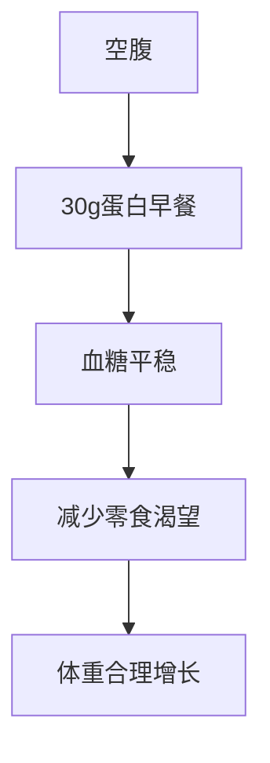
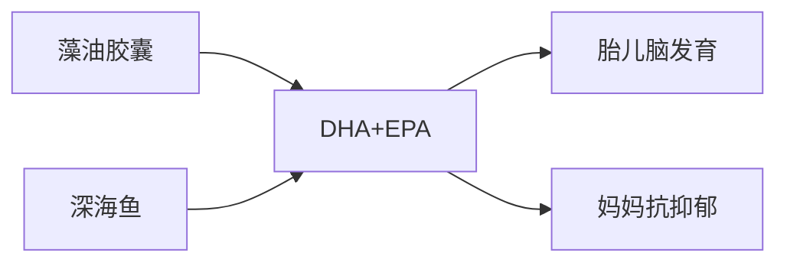
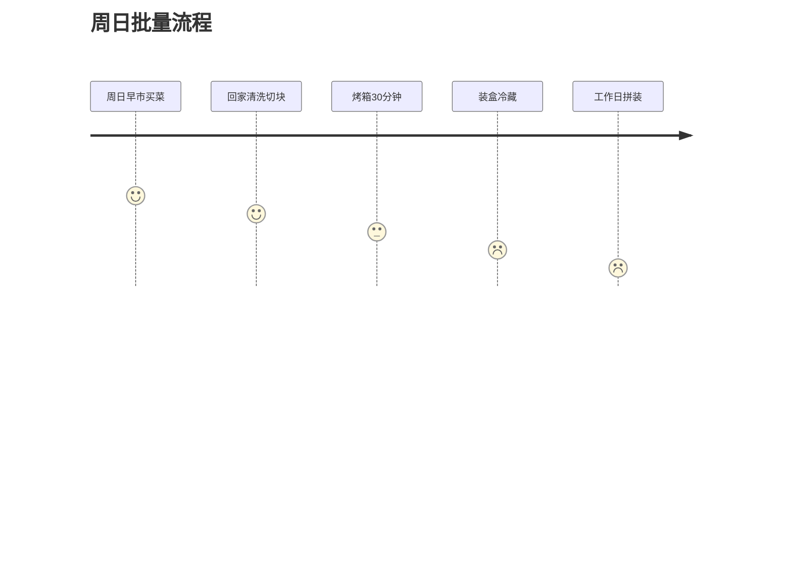

- 直白总结：高蛋白、低升糖、彩虹蔬果+omega-3，每天3顿正餐+3顿加餐，周日一次预处理，5分钟端上桌。
- 你将获得：长胎不长肉、缓解孕吐、宝宝脑发育加分、产后恢复快、老公也能跟着瘦。

## 核心内容
1. 彩虹法则：每餐≥3色植物，确保叶酸、维C、抗氧化一网打尽  
   - 解释：不同颜色代表不同植物化学物，比如番茄红素、花青素、β-胡萝卜素，可协同降低妊娠高血压与胎儿畸形风险。  
   - 例子：Day2午餐“意式彩虹意面”含红黄绿橙四色蔬菜，相当于一次吃掉4种抗氧化剂。  
   - 行动：买菜时按“红橙黄绿紫白”六色清单各拿一种，一周21色即达标。


2. 分时加能量：1-3个月小餐，4-9个月大份，血糖不坐过山车  
   - 解释：孕早期胃被子宫顶，少量多次防恶心；孕中晚期宝宝快速增重，需额外300-450 kcal/日，但一次吃多易高血糖。  
   - 例子：上午10点“1份水果+10颗坚果”=150 kcal，刚好顶到午饭不暴食。  
   - 行动：手机设3个闹钟“10-15-20点”，听到就吃对应组合。

```mermaid
gantt
title 孕期一日进食时间轴
dateFormat  HH:mm
axisFormat %H:%M
section 孕期
早餐    :07:00, 30m
加餐    :10:00, 10m
午餐    :12:00, 30m
加餐    :15:00, 10m
晚餐    :18:00, 30m
加餐    :21:00, 10m
```



3. 蛋白质“双30”原则：30 g早餐+30 g正餐，防肌肉流失与妊娠糖尿病  
   - 解释：夜间禁食后急需氨基酸修复组织，早餐高蛋白可降低全天血糖波动；正餐30 g保证胎儿每日新增1 mm宫高增长。  
   - 例子：Day1早餐“孕期能量奶昔”含希腊酸奶+pasteurized蛋清=32 g蛋白。  
   - 行动：家里备电子秤，先称蛋白源再称蔬果，养成“先蛋白后碳水”装盘顺序。



4. Omega-3直达方案：每周2顿深海鱼+藻油胶囊300 mg，DHA不缺岗  
   - 解释：胎儿5-6月大脑皮层突触爆发性增长，需50-70 mg DHA/日；藻油跳过鱼类食物链，无重金属、纯素友好。  
   - 例子：Day2晚餐“枫糖三文鱼”一块150 g≈1.8 g DHA，一次吃下3天量。  
   - 行动：若吃鱼当天，把胶囊减1粒，既省钱又不超量。



5. 周日“一小时批量”预处理：烤蔬菜+煮谷物+分装冷冻，工作日5分钟拼装  
   - 解释：孕期疲劳+孕傻，降低做饭门槛才能坚持；烤蔬菜冷藏3天、冷冻1月，营养损失<10%。  
   - 例子：一次性烤3斤红薯块，分袋每袋200 g，微波2分钟即食。  
   - 行动：买20个玻璃保鲜盒，周日边追剧边操作，盒子堆成“乐高墙”。



6. 零食“三不”清单：无空热量、无反式脂、无过量糖，替换法防体重暴涨  
   - 解释：孕期基础代谢仅+200 kcal，但一只甜甜圈就450 kcal；用能量球替代可省300 kcal/次，相当于每周少跳1小时孕妇操。  
   - 例子：杏仁能量球1颗≈60 kcal，3颗饱足感=1条巧克力。  
   - 行动：办公室抽屉放冻干鹰嘴豆、能量球、小罐希腊酸奶，把自动售卖机设为“禁区”。

7. 控盐增钾：每日钠<2 g、钾>3.5 g，把水肿与高血压挡在门外  
   - 解释：孕晚期血容量增50%，钠滞留→水肿→妊娠高血压；钾可排钠、放松血管。  
   - 例子：用低钠高汤煮意面，再撒菠菜+鳄梨，一餐补钾1 g。  
   - 行动：购物认准“低钠”标签；把盐罐换成“柠檬胡椒+香草”组合，两周就能适应。

```mermaid
bar chart
title 每100g食物的钾钠比
category 鳄梨, 菠菜, 低钠高汤, 普通盐
series 钾(mg) : [485, 558, 140, 0]
series 钠(mg) : [7, 79, 60, 38758]
```

## 问答
**Q: 孕吐严重，完全吃不下清单里的饭怎么办？**  
A: 把三餐拆成六口——醒来先啃一块冷苹果，再躺10分钟；每隔40分钟吃1小杯冰希腊酸奶+燕麦，总量不变但胃负担减半。

**Q: 素食者如何替代三文鱼补DHA？**  
A: 选含300 mg DHA的藻油胶囊（如Ovega-3），每天1粒；同时餐餐加亚麻籽粉+核桃，提供ALA在体内少量转化，双重保险。

**Q: 可以喝拿铁吗？**  
A: 每天咖啡因≤200 mg≈中杯拿铁1杯，优选低因豆奶拿铁，既补钙又避免反式脂肪。

**Q: 老公也需要跟着吃吗？**  
A: 这套食谱低升糖、高纤维、好油脂，全家都适用；让他陪你吃，妊娠糖尿病家庭餐直接升级为终身健康餐。 
（第1页）
**孕期每周膳食计划**

**第1天**
**早餐**
孕期能量思慕雪
**午餐**
藜麦鹰嘴豆地中海沙拉
**晚餐**
火鸡汉堡配香醋蔬菜沙拉

**第2天**
**早餐**
枫糖香蕉山核桃粥
**午餐**
彩虹意面沙拉
**晚餐**
枫糖三文鱼、红薯和烤蔬菜

**第3天**
**早餐**
炒蛋牛油果卷饼
**午餐**
猎人烩鸡配糙米面条和烤南瓜
**晚餐**
藜麦烤蔬菜沙拉

**第4天**
**早餐**
苹果派早餐芭菲
**午餐**
汉堡包迷你披萨，香醋沙拉
**晚餐**
鸡肉牧羊人派配红薯顶料

**第5天**
**早餐**
羊奶酪菜肉馅煎蛋饼配发芽谷物吐司和牛奶
**午餐**
三文鱼沙拉牛油果三明治
**晚餐**
丰盛素食辣豆汤

**孕期与儿童营养**

（第2页）
**孕期每周膳食计划**

**孕早期零食**
**上午加餐**
水果
**下午加餐**
1/2杯希腊酸奶配蒸香草牛奶或植物奶
**晚间加餐**
蔬菜和鹰嘴豆泥

**孕中期和孕晚期零食（如需可加大分量）**
**上午加餐**
1份水果 + 10颗坚果 或 奇亚籽布丁
**下午加餐**
苹果 + 2片奶酪 或 水果能量球
**晚间加餐**
蓝莓和希腊酸奶 或 3杯空气爆米花

**示例日（时间安排）**
**早餐** **加餐** **午餐** **加餐** **晚餐** **加餐**
**第4天** **提前备餐**
**为本周准备（周日）**
烤好蔬菜、红薯和鸡胸肉。煮熟意面和藜麦。

**7 - 8 AM** **10 AM** **12 PM** **2- 3PM** **5 - 6 PM** **8 - 9 PM**

**孕期与儿童营养**

（第3页）
**食谱**

**孕期能量思慕雪**
**食材：** 2人份
**准备时间：** 5分钟
**烹饪时间：** 0分钟
1. 将所有食材放入搅拌机，搅拌30秒至1分钟。
<pre><code>1 汤匙 大片燕麦片
1 茶匙 火麻仁
1 汤匙 奇亚籽粉
1 根 香蕉
1/4 个 小牛油果
1 杯 冷冻蓝莓
1 把 绿叶蔬菜
1 杯 植物奶（例如杏仁奶）
2 汤匙 巴氏杀菌蛋清</code></pre>

**藜麦鹰嘴豆地中海沙拉**
**食材：** 4人份
**准备时间：** 10分钟
**烹饪时间：** 10分钟
<pre><code>3 杯 干藜麦
6 杯 低钠蔬菜汤
3 杯 芝麻菜
1 罐（15盎司）鹰嘴豆，沥干
1/3 杯 烤红甜椒，沥干并切碎
1/3 杯 去核卡拉马塔橄榄，切片（可选）
1/3 杯 羊奶酪碎
1/4 杯 罗勒，切细丝
1/2 杯 特级初榨橄榄油
1 汤匙 香醋
2 瓣 大蒜，压碎
1/2 茶匙 干罗勒，切碎
1/2 茶匙 干百里香，用手指捏碎</code></pre>
**厨师小贴士：**
1. 提前每周准备好藜麦，这样只需几分钟就能混合所有食材。
2. 用手混合沙拉和自制酱汁，以确保所有蔬菜都均匀裹上酱汁（如果酱汁没有商业稳定剂，用勺子效果不佳！）

**藜麦准备**
1. 将藜麦冲洗干净。将蔬菜汤和藜麦煮沸，然后转小火盖上锅盖（炉灶最低档）。小火煮10分钟，直到水分收干，用叉子拨松。*留一半藜麦供本周晚些时候使用。

**沙拉酱**
1. 将沙拉食材放入一个大碗中。
2. 将酱汁食材淋在上面（用干净的手混合，使所有叶子都裹上酱汁），并用罗勒装饰。室温食用或冷藏备用。

（第4页）
**食谱**

**火鸡汉堡 & 香醋蔬菜沙拉**
**食材：** 4-5人份
**准备时间：** 15分钟
**烹饪时间：** 30分钟
1. 将沙拉食材放入一个大碗中。
2. 将沙拉酱食材搅拌或混合均匀，用干净的手将其与一半的蔬菜混合。*留一半沙拉酱冷藏备用。
3. 放上草莓。室温食用或冷藏备用。
<pre><code>1 个 中等大小的西葫芦，擦丝
1 磅 瘦火鸡肉末
1/4 杯 调味全麦面包屑
1 瓣 大蒜，擦碎
1 汤匙 红洋葱，擦碎
1 茶匙 粗盐和现磨黑胡椒
油喷雾
5 个 全麦汉堡包</code></pre>

**枫糖香蕉山核桃粥**
**食材：** 4人份
**准备时间：** 2分钟
**烹饪时间：** 15分钟
<pre><code>2 杯 大片燕麦片
2 杯 杏仁奶
2 杯 沸水
一小撮盐
1 根 香蕉，切片
1/2 杯 山核桃，烤熟并切碎
3 汤匙 枫糖浆</code></pre>
**燕麦粥制作**
1. 将燕麦片、杏仁奶、沸水和盐用中火煮沸。搅拌并煮约5分钟，直到变稠。
2. 离火，盖上盖子，静置10分钟使其变稠。
3. 将粥舀入碗中，放上香蕉和山核桃，淋上少量枫糖浆。

**火鸡汉堡**
**简易香醋蔬菜沙拉**
<pre><code>3 杯 嫩菠菜或其他绿叶蔬菜
1/2 根 黄瓜，薄片
4 颗 草莓，薄片</code></pre>
**沙拉酱**
<pre><code>1/2 杯 特级初榨橄榄油
1/4 杯 白香醋
2 汤匙 蜂蜜或龙舌兰糖浆
1/2 茶匙 盐
1/4 茶匙 粗磨黑胡椒
1/4 茶匙 意大利调味料</code></pre>

（第5页）
**食谱**

**彩虹意面沙拉**
**食材：** 8人份
**准备时间：** 10分钟
**烹饪时间：** 10分钟
1. 按照包装说明煮好意面，然后用冷水冲洗面条使其冷却。
2. 煮意面时准备蔬菜，放入一个大碗中。
3. 将酱汁食材搅拌在一起。
4. 用干净的手将所有食材混合均匀。
5. 冷藏最多24小时。
<pre><code>1 盒（16盎司）全麦意面
1 杯 圣女果，对半切
1 个 小黄西葫芦，纵向对半切后薄片
1/2 根 黄瓜，纵向对半切后薄片
1 个 西兰花冠，切成小块
1 个 小红洋葱，薄片
1/2 杯 烤红甜椒，薄片
1 个 橙色彩椒，切成小块
1/4 杯 新鲜罗勒，切碎</code></pre>

**枫糖三文鱼、红薯和烤蔬菜**
**食材：** 4人份
**准备时间：** 20分钟
**烹饪时间：** 40分钟
<pre><code>1/4 杯 枫糖浆
2 汤匙 酱油
1 瓣 大蒜，切碎
1/4 茶匙 大蒜盐
1/8 茶匙 黑胡椒粉
2 磅 三文鱼
3 杯 红薯，切块
3 根 中等胡萝卜，切丁
1 1/2 杯 抱子甘蓝，对半切
1 个 中等红洋葱，切丁
1 汤匙 干牛至
1 汤匙 干迷迭香
1 茶匙 干百里香
1 茶匙 干罗勒
1/4 茶匙 盐
1 茶匙 现磨黑胡椒
1/4 杯 橄榄油</code></pre>
**三文鱼**
**红薯和烤蔬菜**
1. 将涂抹在三文鱼上的所有酱汁食材在碗中混合。将三文鱼放入浅玻璃烤盘中，淋上酱汁，腌制30分钟以上。
2. 预热烤箱至400°F。在烤盘上铺上烘焙纸或涂抹橄榄油。将红薯和切好的蔬菜放在烤盘上。加入香草、盐、胡椒和油。用手彻底混合。均匀铺开，烘烤35-40分钟。*留一些烤蔬菜供明天的午餐使用。
3. 当红薯烤了20分钟后，将三文鱼放入烤箱，烤20分钟或直到三文鱼能用叉子轻松剥落。

**意面沙拉酱**
<pre><code>2/3 杯 橄榄油
2/3 杯 红酒醋
2 1/2 汤匙 第戎芥末酱
2 1/2 茶匙 干意大利调味料
4 瓣 大蒜，切碎
1 个 柠檬，取皮屑
1 1/4 茶匙 细海盐
3/4 茶匙 现磨黑胡椒</code></pre>

（第6页）
**食谱**

**炒蛋牛油果卷饼**
**食材：** 4人份
**准备时间：** 5分钟
**烹饪时间：** 5分钟
1. 在一个小碗中，将鸡蛋、牛奶、盐和胡椒搅拌在一起。
2. 在平底锅中用低火加热橄榄油。加入鸡蛋，用平底锅铲轻轻推动3-4分钟，直到鸡蛋成型且蓬松。
3. 拌入牛油果并撒上奇亚籽。
4. 将混合物放入玉米饼卷中，如果需要，可以放上辣酱和/或圣女果，然后卷起来享用。
<pre><code>6 个 鸡蛋，轻轻打散
一小撮盐和胡椒
1/4 杯 牛奶或无糖杏仁奶
1 茶匙 橄榄油
1 个 牛油果，去皮去核并切块
1 汤匙 奇亚籽
辣酱（可选）
圣女果（可选）
4 张 全麦玉米饼卷</code></pre>

**剩余藜麦和烤蔬菜沙拉**
**食材：** 4人份
**准备时间：** 5分钟
**烹饪时间：** 无（使用剩菜）
<pre><code>3 杯 新鲜绿叶蔬菜（菠菜、羽衣甘蓝或其他）
1 1/2 杯 剩余的烤蔬菜
1 杯 剩余的藜麦
3 汤匙 特级初榨橄榄油
2 茶匙 第戎芥末酱
1/2 茶匙 盐
1/2 茶匙 黑胡椒
1/3 杯 山羊奶酪，弄碎
2 汤匙 奇亚籽
1/4 杯 切碎的无盐烤杏仁</code></pre>
1. 在一个大碗中混合绿叶蔬菜、烤蔬菜和藜麦。
2. 将油、芥末酱、盐、胡椒搅拌在一起，然后拌匀裹上酱汁。
3. 盛入碗中，撒上山羊奶酪、杏仁和奇亚籽。

（第7页）
**食谱**

**猎人烩鸡配糙米面条和烤南瓜**
**食材：** 4人份
**准备时间：** 20分钟
**烹饪时间：** 40分钟
1. 将鸡肉与面粉、盐和胡椒拌匀。在一个大的浅荷兰锅中，用中高火在1汤匙油中将鸡肉煎至棕色。
2. 在锅中加热剩余的油，用中火煎洋葱、大蒜、青椒和意大利调味料，直到变软，约4分钟。加入番茄、高汤和番茄酱搅拌；煮沸。
3. 将鸡肉放回锅中；转小火炖20分钟，直到鸡肉汁液变清或鸡肉内部温度达到165°F。*留一些鸡肉供午餐使用。
4. 搭配糙米面条食用。
<pre><code>1 个 冬南瓜，对半切，淋上橄榄油，切面朝下放在铺好烘焙纸的烤盘上。在400°F下烘烤40分钟。</code></pre>

**苹果派早餐芭菲**
**食材：** 1人份
**准备时间：** 2分钟
**烹饪时间：** 10分钟
<pre><code>1 个 苹果，切块（可选去皮）
1 汤匙 柠檬汁
1 汤匙 水
1 茶匙 枫糖浆（可选）
1/2 茶匙 肉桂粉
2 汤匙 健康格兰诺拉麦片（我用了Holy Crap品牌）
1/2 杯 香草希腊酸奶</code></pre>
**芭菲制作**
1. 在一个小炖锅中，用中火加热苹果、柠檬汁、水和肉桂，直到苹果变软。离火，让其冷却。
2. 分层放入苹果混合物、酸奶，顶部放上格兰诺拉麦片。

**南瓜**
**猎人烩鸡**
<pre><code>8 块 带骨鸡腿
2 汤匙 通用面粉
1/2 茶匙 盐
1/4 茶匙 胡椒
2 汤匙 植物油
1 个 洋葱，切丁
2 瓣 大蒜，切碎
1 个 甜青椒，切块
1 茶匙 干意大利香草调味料
1 罐（28盎司）番茄丁
1/2 杯 减钠鸡汤
1/3 杯（75毫升）番茄酱
1 包 糙米面条，按包装说明煮熟</code></pre>

（第8页）
**食谱**

**汉堡包迷你披萨和香醋鸡肉沙拉**
**食材：** 4人份
**准备时间：** 5-10分钟
**烹饪时间：** 8分钟
1. 预热烤箱至425°F。
2. 用擀面杖压平汉堡包。
3. 涂上披萨酱、奶酪和喜欢的配料。
4. 烘烤6-8分钟，直到奶酪起泡，汉堡包变成棕色。
<pre><code>2 个 全麦汉堡包
1 小罐 披萨酱（或1/2杯自制）
1/2 杯 磨碎的奶酪
自选蔬菜配料（可选）</code></pre>

**鸡肉牧羊人派配红薯顶料**
**食材：** 4人份
**准备时间：** 15分钟
**烹饪时间：** 40分钟
<pre><code>1 磅 鸡肉末或火鸡肉末
2 根 中等胡萝卜，去皮切块
1 个 小青椒，切块
1 个 小洋葱，切块
1 杯 蘑菇，切丁
2 瓣 大蒜，切碎
1 茶匙 辣椒粉
1/2 茶匙 干迷迭香
1/2 茶匙 海盐或适量
1/4 茶匙 黑胡椒
6 汤匙 番茄酱
1/4 杯 水
5 杯 红薯，去皮切块
1 汤匙 椰子油
1/4 杯 牛奶或无糖杏仁奶
1/4 茶匙 盐</code></pre>
**馅料**
**红薯顶料**
1. 预热烤箱至375°F。
2. 在煎锅中，用中低火炒香洋葱和大蒜。加入鸡肉末和其他蔬菜。用中火翻炒，直到鸡肉变棕色，胡萝卜变软（12-15分钟）。
3. 加入番茄酱、水和调味料。
4. 将红薯煮软，直到能用叉子轻易刺穿。
5. 与其他顶料食材一起捣成泥。
6. 将肉馅转移到9x9英寸的烤盘中，顶部铺上红薯泥。
7. 烘烤10分钟，取出烤箱即可食用。

**汉堡包迷你披萨**
**香醋鸡肉沙拉**
<pre><code>8 杯 混合沙拉蔬菜或菠菜
2 个 番茄，切块
1 个 牛油果，切片
1/4 杯 羊奶酪碎
猎人烩鸡剩余的鸡肉块
1/2 份 剩余的香醋酱汁
一小撮意大利调味料</code></pre>
1. 在披萨烘烤时，将蔬菜、番茄、牛油果、剩余鸡肉和意大利调味料拌匀。
2. 淋上剩余的酱汁，撒上羊奶酪。

（第9页）
**食谱**

**菠菜羊奶酪菜肉馅煎蛋饼配发芽谷物吐司和牛奶**
**食材：** 4人份
**准备时间：** 10分钟
**烹饪时间：** 25分钟
1. 预热烤箱至450°F。
2. 在一个中等大小的不粘耐热煎锅中，用中高火加热橄榄油。加入大葱和菠菜，翻炒至变软，约4分钟。拌入1/2茶匙盐和适量胡椒；离火。
3. 在一个大碗中，将鸡蛋、2汤匙面包屑、3/4杯水和1/2茶匙盐搅拌在一起。
4. 将鸡蛋混合物和羊奶酪加入煎锅中，搅拌均匀。
5. 撒上剩余的2汤匙面包屑。
6. 将煎锅放入烤箱，烘烤约15分钟，直到煎蛋饼凝固，顶部呈金黄色。
7. 搭配一片烤过的发芽谷物面包和一杯牛奶或植物奶（例如杏仁奶）食用。
<pre><code>2 汤匙 特级初榨橄榄油
1 把 大葱，切片
1 包（5盎司）嫩菠菜
1 茶匙 盐
1/2 茶匙 现磨黑胡椒
8 个 大鸡蛋
4 汤匙 全麦面包屑
1/2

（第1页） 怀孕每周膳食计划

| 日期 | 早餐                               | 午餐                                   | 晚餐                                                              |
| ---- | ---------------------------------- | -------------------------------------- | ----------------------------------------------------------------- |
| 1    | 怀孕能量思慕雪                       | 藜麦地中海鹰嘴豆沙拉                     | 火鸡汉堡和香醋蔬菜沙拉                                            |
| 2    | 枫糖香蕉山核桃燕麦粥                   | 彩虹意大利面沙拉                         | 枫糖釉三文鱼、甜土豆和烤蔬菜                                      |
| 3    | 炒鸡蛋和牛油果卷                       | 藜麦和烤蔬菜沙拉                         | 意式烩鸡配糙米面和烤南瓜                                          |
| 4    | 苹果派早餐芭菲                       | 汉堡面包迷你披萨、香醋沙拉               | 鸡肉牧羊人派和甜土豆顶                                            |
| 5    | 羊乳酪烘蛋和发芽谷物吐司配牛奶         | 三文鱼沙拉牛油果三明治                   | 丰盛的素食辣椒                                                    |

怀孕和儿童营养

（第2页） 怀孕每周膳食计划

**孕早期零食**

| 时间     | 零食                               |
| -------- | ---------------------------------- |
| 上午     | 水果                               |
| 下午     | 1/2杯希腊酸奶                         |
| 晚上     | 蔬菜和鹰嘴豆泥配蒸香草牛奶或替代奶 |

**孕中期和孕晚期零食（如果需要，可增加份量）**

| 时间     | 零食                               |
| -------- | ---------------------------------- |
| 上午     | 1个水果 + 10个坚果 或 奇亚籽布丁   |
| 下午     | 苹果 + 2片奶酪 或 水果能量球       |
| 晚上     | 蓝莓和希腊酸奶 或 3杯爆米花        |

**示例日（时间安排）**

| 时间     | 膳食     |
| -------- | -------- |
| 7 - 8 AM | 早餐     |
| 10 AM    | 零食     |
| 12 PM    | 午餐     |
| 2- 3PM   | 零食     |
| 5 - 6 PM | 晚餐     |
| 8 - 9 PM | 零食     |

**第四天膳食准备**

提前一周准备（周日）

烤蔬菜、甜土豆和鸡胸肉。煮意面和藜麦。

怀孕和儿童营养

（第3页） 食谱

**怀孕能量思慕雪**

份量：2人份
准备时间：5分钟
烹饪时间：0分钟

材料：

*   1汤匙大片燕麦
*   1茶匙麻籽
*   1汤匙磨碎的奇亚籽
*   1根香蕉
*   1/4个小牛油果
*   1杯冷冻蓝莓
*   1把绿色叶菜
*   1杯替代奶（例如杏仁奶）
*   2汤匙巴氏杀菌蛋清

做法：

1.  将所有材料放入搅拌机中搅拌30秒至1分钟。

**藜麦地中海鹰嘴豆沙拉**

份量：4人份
准备时间：10分钟
烹饪时间：10分钟

材料：

*   3杯干藜麦
*   6杯低钠蔬菜汤
*   3杯芝麻菜
*   1罐15盎司鹰嘴豆，沥干水分
*   ⅓杯烤红甜椒，沥干水分并切碎
*   ⅓杯去核卡拉马塔橄榄，切片（可选）
*   ⅓杯羊乳酪碎
*   ¼杯罗勒，切成薄片
*   ½杯特级初榨橄榄油
*   1汤匙香醋
*   2瓣蒜，压碎
*   ½茶匙干罗勒，切碎
*   ½茶匙干百里香，用手指碾碎

厨师小贴士：

1.  每周提前准备藜麦，然后只需几分钟即可将所有材料混合在一起
2.  用手混合沙拉和自制调味料，以使所有蔬菜都能得到最佳覆盖（如果调味料没有商业稳定剂，则勺子根本无法做到！）  


