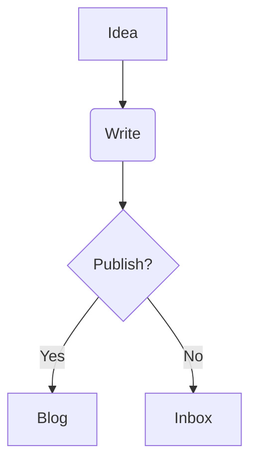

# 🌿 Obsidian to Blog: Validated Workflow

This guide details your new "Unified Workflow" for publishing from Obsidian to your `mengxi.space` blog.

## 1. Folder Structure (Obsidian)

We have organized your Vault into these key zones. Please create these folders if they don't exist:

*   **`Inbox/`** 📥
    *   *Purpose*: Quick capture. Dump raw ideas here.
    *   *Status*: Files here are **IGNORED** by the blog sync (Drafts).
*   **`Sparks/`** ✨
    *   *Purpose*: 灵感闪念 (Short thoughts, tweets).
    *   *Blog Category*: `sparks`
*   **`Notes/`** 📝
    *   *Purpose*: 学习笔记 (Study notes, reference).
    *   *Blog Category*: `notes`
*   **`Ideas/`** 💡
    *   *Purpose*: 想法实验室 (Essays, opinions).
    *   *Blog Category*: `ideas`
*   **`Growth/`** 🌱
    *   *Purpose*: 成长日志 (Reflections, journals).
    *   *Blog Category*: `growth`

## 2. Frontmatter & Status

You don't need to write complex frontmatter manually. The script handles most of it.
However, to control publishing status:

*   **Drafts**: Just keep them in `Inbox/` OR add `status: draft` in the text.
*   **Publishing**:
    *   Move the file to one of the active folders (`Sparks`, `Notes`, etc.).
    *   The sync script will automatically pick it up, valid title/date, and publish it.

## 3. Image Handling

*   **Drag & Drop**: Just drag images into Obsidian as usual (`![[image.png]]`).
*   **Auto-Cloud**: When you sync, the script automatically:
    1.  Finds the image on your disk.
    2.  Uploads it to your R2 Cloud (`img.mengxi.space`).
    3.  Replaces the link in the blog post.
    *   *Note: First sync might take time to upload historical images.*

## 4. One-Click Publish

To publish your site, just run the "Publish Blog" app (or script):

```bash
~/mengxi-first-ai-project/scripts/sync-and-publish.sh
```

**What it does:**
1.  **Syncs**: Moves MD files + Uploads Images.
2.  **Builds**: Generates the Hugo site.
3.  **Deploys**: Pushes to Cloudflare Pages.
4.  **Notifies**: Pings you when done.

## 5. Daily Routine

1.  **Capture**: CMD+N in Obsidian -> Save to `Inbox/`.
2.  **Refine**: When ready, drag note to `Ideas/` (or other category).
3.  **Publish**: Click your script/app.
4.  **Verify**: Visit [mengxi.space](https://mengxi.space).

---
*Happy Writing!* ✒️

---

## 6. Diagram & Visual Notes (Nano Banana Workflow) 🍌

We have integrated the **Nano Banana Pro** workflow to automatically style your diagrams.

### 🤖 Automatic Hand-Drawn Diagrams
Any standard Mermaid code block in your Obsidian notes will **automatically** be rendered on the blog with a "Hand-Drawn" sketch style (using the 'Patrick Hand' font).

**How to use:**
Just write standard Mermaid code:



It will appear as a beautiful sketch on the site!

### 🎨 Hero Visual Notes (AI Generated)
For your most important concepts (like huge mindmaps), we use a high-fidelity process:
1.  **Extract**: Identify the complex mermaid block.
2.  **Generate**: Use AI to create a rich, visual sketch note image.
3.  **Embed**: Place the image (`![[image.png]]`) in Obsidian.
4.  **Sync**: The script automatically handles the upload.
