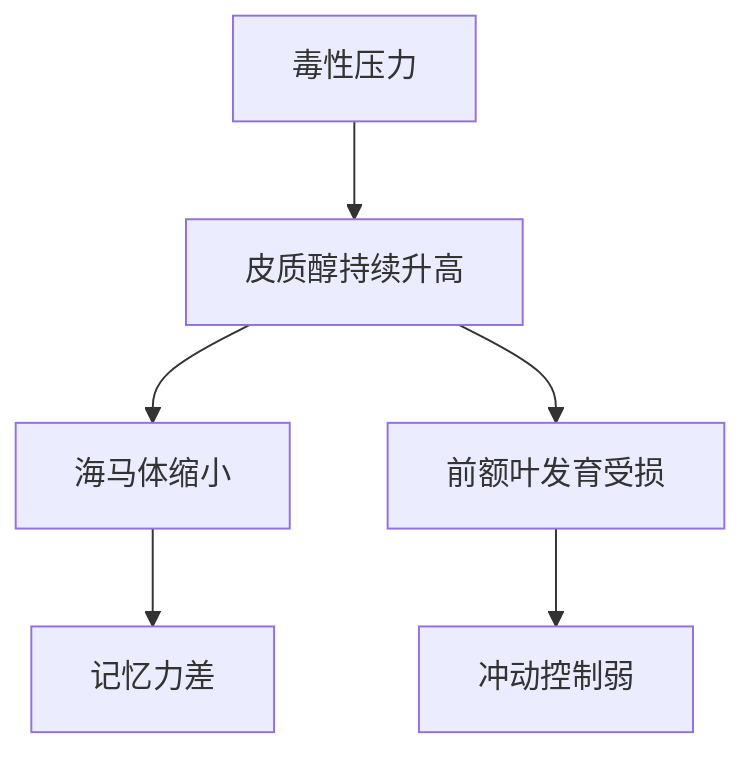
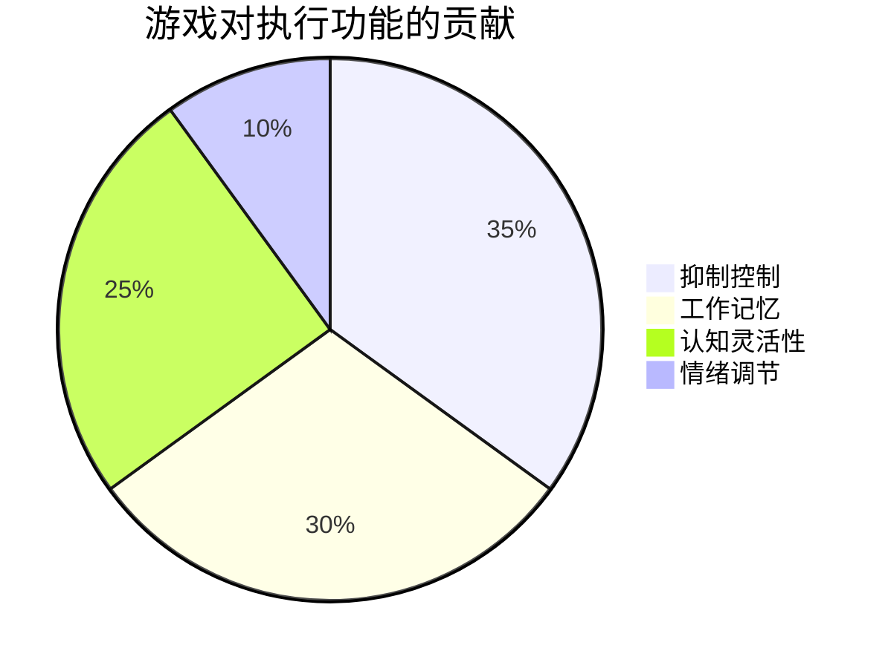

## 参考文献总结（这本书的理论根基）
这是一份极具分量的早期儿童发展心理学参考文献清单，汇集了50年来附件理论、自我调节、执行功能、情绪调节、游戏与学习的顶级研究。阅读这些文献，能彻底搞懂0-6岁孩子大脑与情绪发展的科学依据。

你能获得：
- 彻底理解安全依恋如何塑造孩子一生自我控制力
- 掌握哈佛大学、Diamond、Kochanska等顶尖团队的实证结论
- 知道游戏、睡眠、亲子互动如何直接影响孩子大脑前额叶发育
- 拥有教育孩子最硬核的科学底气，不再被育儿谣言迷惑

## 核心内容（参考文献透露的10个最重要结论）

1. 安全依恋是自我调节的根基  
   Bowlby、Ainsworth的经典研究证明：1岁时在“陌生情境”中表现出安全依恋的孩子，长大后情绪调节、执行功能显著更好。

2. 早期压力会永久改变大脑结构  
   Gunnar、Shonkoff研究显示：持续高皮质醇（毒性压力）会损伤海马和前额叶，导致孩子日后注意力、情绪控制困难。

3. 执行功能（大脑的“空中交通管制系统”）在3-3-5岁快速成型  
   Harvard Center on the Developing Child、Diamond（2013）强调：这段时间的亲子互动、游戏、睡眠质量直接决定孩子未来学业与人生成功。

4. 游戏是最高级的自我调节训练  
   Bodrova & Leong的“心智工具”、Hirsh-Pasek、Galinsky等研究一致证明：自由游戏、假装游戏比任何早教课程更能锻炼抑制控制、工作记忆、认知灵活性。

5. 睡眠不足直接摧毁情绪调节能力  
   Berger（2012）、Mindell（2010）发现：30-36个月幼儿只要急性睡眠限制一晚，第二天负面情绪暴增、正面情绪骤减。

6. 父母的“条件性关注”会让孩子失去情绪调节能力  
   Assor & Roth（2010）发现：父母常用爱作为奖励或惩罚工具（“你不听话妈妈就不喜欢你了”），孩子长大后孩子面对悲伤时束手无策。

7. 情绪调节和认知控制是互相成就的  
   Blair、Diamond、Gray研究表明：会管理情绪的孩子，大脑前额叶更容易发育；反过来，执行功能强的孩子也更会调节情绪，形成正向循环。

8. 过度教学反而阻碍探索与发现  
   Bonawitz（2011）经典实验：老师直接教玩具玩法的那组孩子，随后自主探索时间显著少于没被教的那组——“教得太多，学得越少”。

9. 基因×环境交互决定自我调节最终水平  
   Kochanska（2009）发现：同样基因的孩子，在温暖回应式教养下的自我控制力远高于冷漠或惩罚式教养。

10. 右脑在婴儿期负责情绪调节的硬件搭建  
    Schore（2001）提出：0-2岁母亲的高敏感互动，直接塑造孩子右脑眶额皮层，这是终身情绪调节的生理基础。

## 问答

**Q：哪些文献最值得家长必读？**  
A：优先读这4篇就够打底：  
1. Bowlby《A Secure Base》（1988）——依恋理论入门  
2. Harvard《Building the Brain’s “Air Traffic Control” System》（2011）——执行功能通俗版  
3. Diamond《Executive Functions》（2013）——执行功能最权威综述  
4. Galinsky《Mind in the Making》（2010）——把科学变成7个家长期望技能

**Q：这本书的理论最核心的支撑来自谁？**  
A：依恋理论（Bowlby、Ainsworth）、执行功能（Diamond、Blair）、Vygotsky学派游戏与支架理论（Bodrova & Leong）、毒性压力模型（Shonkoff、Gunnar）这四大支柱。

**Q：如果只抓一个词概括所有文献的共识是什么？**  
A：“敏感而回应的教养 + 大量自由游戏 + 充足睡眠” = 孩子自我调节与执行功能的最佳发育条件。其他都是围绕这三点展开的证据。

