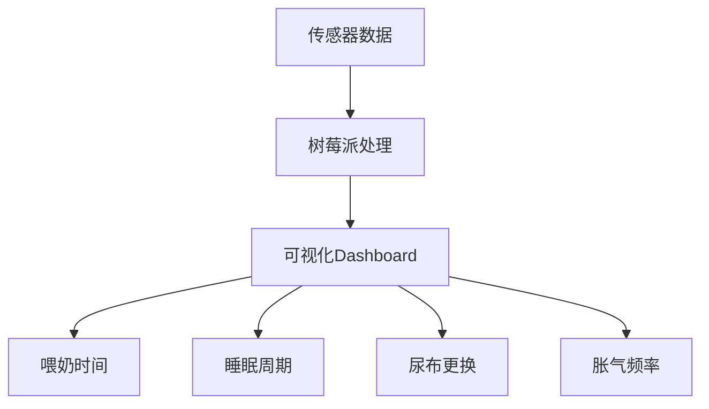

# 育儿极客笔记：当飞机抱遇上树莓派，我如何用代码安抚胀气的宝宝

> "育儿像写代码——bug 总是突如其来，但调试的过程让一切变得有迹可循。"

今晚，我的小程序员（哦不，是小宝宝）又上线了一个意料之外的"异常"：胀气。那种撕心裂肺的哭声，像极了服务器在半夜突然崩溃时的警报。我手忙脚乱地切换着各种"解决方案"——拍嗝、按摩、换尿布——直到"飞机抱"这个神奇的姿势像一行精准的代码，瞬间让一切恢复平静。

## 1. 飞机抱：人体工学的奇迹
**飞机抱**（Airplane Hold）并不是什么黑科技，但它背后蕴含的生物力学原理却让我这个极客妈妈着迷：
- **腹部压力**：宝宝趴在妈妈手臂上，重力自然帮助排出肠道气体。
- **安全感**：类似子宫内的蜷缩姿势，触发宝宝的"安抚反射"。
- **温度传递**：妈妈的体温通过手臂传递，缓解肠痉挛。

> 我突然想到，这不就是最原始的"用户体验设计"吗？在宝宝无法用语言表达需求时，我们通过肢体语言和科学原理，完成了一次完美的"需求对接"。

## 2. 喂奶姿势：从"野路子"到"标准化流程"
胀气的元凶之一，可能是我喂奶时的姿势不够规范。作为一个习惯了"快速迭代"的开发者，我意识到育儿也需要建立一套"标准操作流程"（SOP）：
- **正确姿势**：宝宝下巴贴近乳房，嘴巴完全含住乳晕，避免吸入过多空气。
- **时间管理**：每次喂奶控制在15-20分钟，避免过度喂养导致消化不良。
- **打嗝仪式**：喂奶后至少拍嗝5分钟，就像代码提交前的必备测试。

**极客妈妈的小贴士**：
- 可以用手机计时器记录每次喂奶时长，避免"内存泄漏"（即宝宝吃着吃着睡着，导致奶量不足或过量）。
- 观察宝宝的"错误日志"——比如吐奶、哭闹频率——来调整喂养策略。

## 3. 树莓派育儿 Dashboard：当数据遇上亲子时光
既然育儿充满了不确定性，为什么不引入数据驱动的思维呢？我脑海中已经浮现出一个基于树莓派的"育儿仪表盘"雏形：

**功能设想**：
- **自动打卡**：通过按钮或语音识别记录喂奶、换尿布时间，生成每日"育儿报告"。
- **异常预警**：当胀气频率超过阈值时，自动提示调整喂奶姿势或尝试飞机抱。
- **趋势分析**：长期数据可视化，帮助发现宝宝的生长规律（比如每晚22点是否总是哭闹高峰期）。

> 这不就是把 DevOps 的理念搬到了育儿上吗？持续监控、快速反馈、不断优化。

## 4. 育儿与编程：意外的相似性
在安抚宝宝的过程中，我惊讶地发现育儿和编程竟有这么多相似之处：

| 育儿场景               | 编程概念               | 解决方案                     |
|------------------------|------------------------|------------------------------|
| 宝宝无故哭闹           | 运行时错误（Runtime Error） | 逐步排查（尿布？饿？困？）   |
| 喂奶姿势不当导致胀气   | 逻辑漏洞（Logic Bug）   | 重构流程（调整姿势+拍嗝）    |
| 睡眠训练               | 算法优化（Algorithm Optimization） | 建立规律（EASY法则）         |
| 宝宝成长里程碑         | 版本迭代（Version Update） | 记录并庆祝每个"小版本"       |

**最让我感慨的是**：
- **耐心是最好的调试工具**。再复杂的代码也能被耐心拆解，再难哄的宝宝也能被温柔安抚。
- **失败是常态**。就像代码总有bug，育儿也总有手忙脚乱的时候——但每次"修复"后，我们都变得更强大。

## 5. 写在最后：育儿是一场没有终点的黑客马拉松
今晚的经历让我意识到，育儿并不是一场需要"完美"的考试，而是一场需要持续学习、不断迭代的"黑客马拉松"。我们可能永远无法预测下一个"bug"何时出现，但我们可以：
- 用科学的方法武装自己（比如飞机抱背后的生理学原理）。
- 用技术的力量简化流程（比如树莓派Dashboard）。
- 用温柔的心态拥抱不确定性（因为宝宝永远是最好的"产品经理"，总能给出意想不到的需求）。

> 所以，亲爱的极客妈妈们，当你又一次在半夜被宝宝的哭声"叫醒"时，不妨把它当作一次"系统维护"的机会——调试、优化、然后继续前行。

**下周计划**：
- [ ] 研究树莓派+Python搭建育儿Dashboard的可行性。
- [ ] 记录宝宝胀气频率与喂奶姿势的关联性（数据采集中...）。
- [ ] 尝试将飞机抱姿势标准化，形成"育儿API文档"。

愿每个在育儿路上摸爬滚打的极客妈妈，都能找到属于自己的"调试秘籍"。🚀

